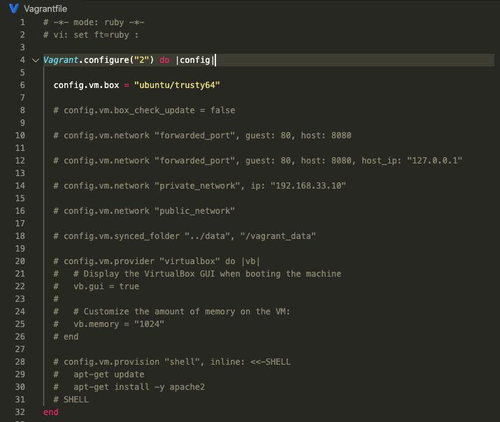
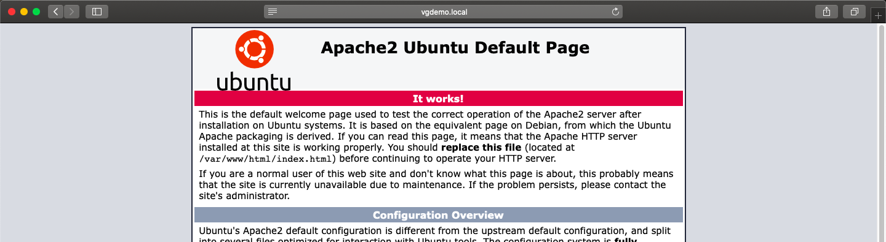

# Working with __Vagrant__

## Basic Usage

- ## Initialize **Vagrant** 
```bash
vagrant init [name [url]]
```
### Example:
```bash
vagrant init hashicorp/precise64
```


- ## To **create / configure** guest machines according to **Vagrantfile** 
```bash
vagrant up [name|id]
```
### Example:
```bash
vagrant up 
```


- ## Connect to **running machine** using **SSH**
```bash
vagrant ssh [name|id] [-- extra_ssh_args]
```
### Example:
```bash
vagrant ssh
```

### Running `date` command on guest machine:


- ## **Stopping** and **Deleting** machine
> Vagrant `suspend` effectively saves the exact point-in-time state of the machine, so that when you resume it later, it begins running immediately from that point, rather than doing a full boot.

```bash
vagrant suspend [name|id]
```
> Vagrant `halt` command will first attempt to gracefully shut down the machine by running the guest OS shutdown mechanism. If this fails, or if the --force flag is specified, Vagrant will effectively just shut off power to the machine.

```bash
vagrant halt [name|id]
```

> Vagrant `destroy` command stops the running machine Vagrant is managing and destroys all resources that were created during the machine creation process. After running this command, your computer should be left at a clean state, as if you never created the guest machine in the first place.

```bash
vagrant destroy [name|id]
```

### Example:
#### Shutting down machine
```bash
vagrant halt
```
#### Destroying machine
```bash
vagrant destroy
```


## Creating **LAMP** Stack Dev Env on **Vagrant Box**

- ## Initialize **Vagrant**
```bash
mkdir vagrantdemo

cd vagrantdemo/

vagrant init ubuntu/trusty64
``` 


- ## Initialize **Vagrant**
```bash
mkdir vagrantdemo

cd vagrantdemo/

vagrant init ubuntu/trusty64
``` 

#### Initial Vagrant file:



- ## Setting up **Vagrant** Box **Provider**


- ## Creating **Vagrant Box**


- ## **SSH** into **Vagrant Box**


#### Updating packages:
```bash
sudo apt update
``` 
#### Cheking for Apache Server:
```bash
ls /var/www
```
 

#### Installing Apache Server:
```bash
sudo apt install apache2
```
#### Cheking for Apache Server again:
```bash
ls /var/www
```
 

- ## Setting up Vagrant Box **Port Forwarding**


- ## Exit **SSH** session


- ## Reload **Vagrant Box**
```bash
vagrant reload
```
- ## Checking **Port Forwarding** from **host** machine


- ## Setting up Vagrant Box **Private Network**


- ## **Suspend** & **Reload** Vagrant Box
```bash
vagrant suspend

vagrant reload
```

- ## Checking Vagrant Box **Private Network**


- ## Adding **local** Domain Name on **host** machine
```bash
sudo nano /etc/hosts
```


- ## Checking **local** Domain Name for **Apache Server**



- ## Setting up Vagrant Box **Synced Folders** for Apache Server


- ## Reload **Vagrant Box**
```bash
vagrant reload
```

- ## Creating basic **index.html** file to serve


- ## Adding **Provision**


- ## Creating **Vagrant Box** with all the changes
```bash
vagrant halt

vagrant destroy

vagrant up
```
- ## Creating **MySQL** test table


> This article is based on [Official Vagrant Documentation](https://www.vagrantup.com/docs/index "Official Documentation")


