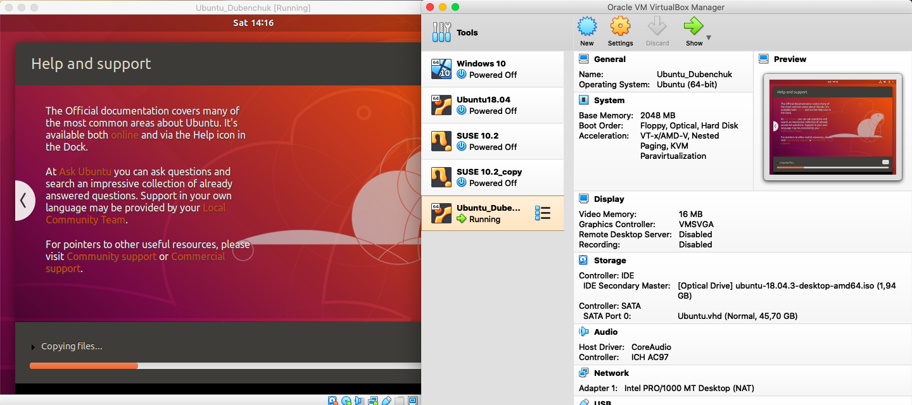
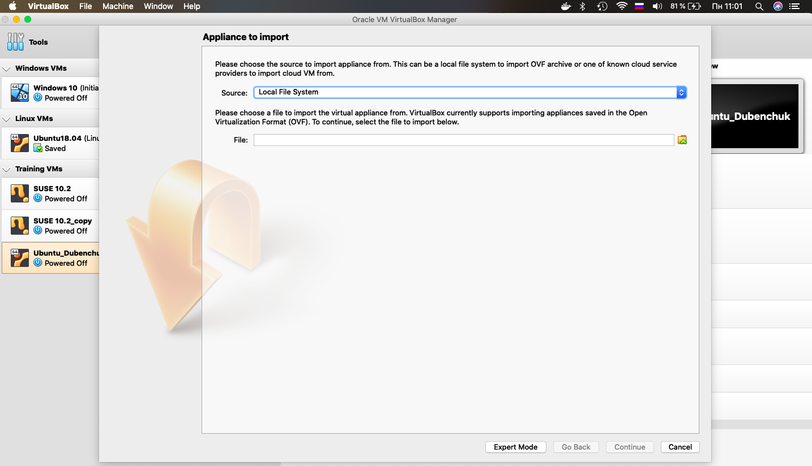
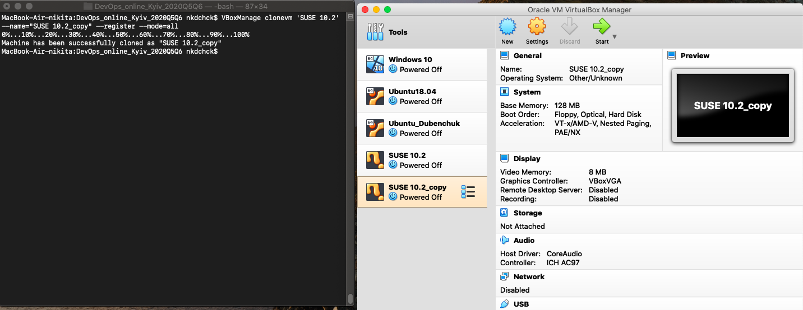

# Working with Oracle __VirtualBox__

## __VirtualBox__ VM GUI

### [<u>Creating __VirtualBox__ VM</u>](https://docs.oracle.com/en/virtualization/virtualbox/6.1/user/gui-createvm.html "Official Docs")





___

### [<u>Cloning __VirtualBox__ VM</u>](https://docs.oracle.com/en/virtualization/virtualbox/6.1/user/clone.html "Official Docs")


- **Clone Types** 
    - *Full Clone* (Copies all dependent disk images to the new VM folder. A full clone can operate fully without the source VM)
    - *Linked Clone* (Creates new differencing disk images based on the source VM disk images. If you select the current state of the source VM as the clone point, Oracle VM VirtualBox creates a new snapshot)


___

### [<u>Using VM **Groups**</u>](https://docs.oracle.com/en/virtualization/virtualbox/6.1/user/gui-vmgroups.html "Official Docs")

#### Using VirtualBox GUI:


#### Using VBoxManage CLI:
```bash
VBoxManage modifyvm "Windows 10" --groups "/Windows VMs"

VBoxManage modifyvm "Ubuntu18.04" --groups "/Linux VMs"

VBoxManage modifyvm "SUSE 10.2" --groups "/Training VMs"

VBoxManage modifyvm "SUSE 10.2_copy" --groups "/Training VMs"

VBoxManage modifyvm "Ubuntu_Dubenchuk" --groups "/Training VMs"
```

___

### [<u>Working with **Snapshots**</u>](https://docs.oracle.com/en/virtualization/virtualbox/6.1/user/snapshots.html "Official Docs")


___

### [<u>**Import / Export** VirtualBox VMs</u>](https://docs.oracle.com/en/virtualization/virtualbox/6.1/user/ovf.html "Official Docs")





___

### [<u>**Configuring** VMs</u>](https://docs.oracle.com/en/virtualization/virtualbox/6.1/user/BasicConcepts.html "Official Docs")


#### Main VirtualBox Settings:

- [General Settings](https://docs.oracle.com/en/virtualization/virtualbox/6.1/user/generalsettings.html "Official Docs")
- [System Settings](https://docs.oracle.com/en/virtualization/virtualbox/6.1/user/settings-system.html "Official Docs")
- [Display Settings](https://docs.oracle.com/en/virtualization/virtualbox/6.1/user/settings-display.html "Official Docs")
- [Storage Settings](https://docs.oracle.com/en/virtualization/virtualbox/6.1/user/settings-storage.html "Official Docs")
- [Audio Settings](https://docs.oracle.com/en/virtualization/virtualbox/6.1/user/settings-audio.html "Official Docs")
- [Network Settings](https://docs.oracle.com/en/virtualization/virtualbox/6.1/user/settings-network.html "Official Docs")
- [Serial Ports](https://docs.oracle.com/en/virtualization/virtualbox/6.1/user/serialports.html "Official Docs")
- [USB Support](https://docs.oracle.com/en/virtualization/virtualbox/6.1/user/usb-support.html "Official Docs")
- [Shared Folders](https://docs.oracle.com/en/virtualization/virtualbox/6.1/user/shared-folders.html# "Official Docs")
- [User Interface](https://docs.oracle.com/en/virtualization/virtualbox/6.1/user/user-interface.html "Official Docs")

#### To enable *Drag'n'Drop* functionality:
##### Go to: `Settings > General > Advanced`


#### To enable *Screen Recording*:
##### Go to: `Settings > Display > Recording`


#### Configuring *USB ports*:
##### Go to: `Settings > Ports > USB`
##### In case VM is running: `Devices > USB`


#### To configure *Shared Folder*:
##### Go to: `Settings > Shared Folders`
##### In case VM is running: `Devices > Shared Folders`


___

## [VirtualBox **Virtual Networking**](https://docs.oracle.com/en/virtualization/virtualbox/6.1/user/networkingdetails.html "Official Docs")

#### Main Networking Modes:
- NAT (Network Address Translation)
- NAT Network
- Bridged networking
- Internal networking
- Host-only networking

#### To configure *Networking Mode*:
##### Go to: `Settings > Network`


#### Overview of Networking Modes


- #### NAT (Network Address Translation) mode


#### Checking *`VM->Host`*


#### Checking *`VM->Net/LAN`*


#### Setting up **Port Forwarding**
##### Go to: `Settings > Network > Advanced > Port Forwarding`

##### Cheking SSH on guest:

##### Checking *`VM<-Host`* using SSH:


#### Using VBoxManage CLI
##### Create Port Forwarding rule:
```bash
VBoxManage modifyvm "Ubuntu18.04" --natpf1 "guestssh,tcp,,2281,,22"
```
##### Delete Port Forwarding rule:
```bash
VBoxManage modifyvm "Ubuntu18.04" --natpf1 delete "guestssh"
```


- #### NAT Network (NAT Service)
> The main difference from simple **NAT** is ability of VMs **in one NAT Network** to communicate betweeen each other.


#### Creating **NAT Network**
##### Go to: `VirtualBox/File > Preferences > Network`

#### Using VBoxManage CLI
##### Creating NAT Network with DHCP server:
```bash
VBoxManage natnetwork add --netname "Network 1" --network "10.0.2.0/24" --enable --dhcp on
```
##### *Start* NAT Network Service:
```bash
VBoxManage natnetwork start --netname "Network 1"
```
##### *Stop* NAT Network Service:
```bash
VBoxManage natnetwork stop --netname "Network 1"
```
##### *Delete* NAT Network Service:
```bash
VBoxManage natnetwork remove --netname "Network 1"
```
#### Assigning NAT Network to VM
##### Go to: `Settings > Network`

#### Checking *`VM1<->VM2`*:


- #### Bridged Adapter


#### Setting up **Bridged Adapter**
##### Go to: `Settings > Network`

#### Checking *`VM->Host`* and `VM<-Host`:


- #### Internal Network

#### Setting up **Internal Network**
##### Go to: `Settings > Network`


- #### Host-only Network

#### Setting up **Host-only Adapter**
##### Go to: `Settings > Network`


___

## Main **VirtualBox** CLI commands


### <u>**CLI commands structure**</u>

```bash
VBoxManage [<general options>] <commands> [<option>]
```

#### Some of the `<general options>`:
 
```bash
[-v|--version]      Show VirtualBox version
```

#### Some of the `<commands>`:

- **[`list`](https://docs.oracle.com/en/virtualization/virtualbox/6.1/user/vboxmanage-list.html "Official Documentation")** 
    - `vms` [ `--long` ]
    - `runningvms`
    - `groups`
    - **[`...`](https://docs.oracle.com/en/virtualization/virtualbox/6.1/user/vboxmanage-list.html "Official Documentation")**

> The `list` command gives relevant information about your system and information about Oracle VM VirtualBox's current settings.

> Example: 

```bash
VBoxManage list vms
```


___

- **[`showvminfo`](https://docs.oracle.com/en/virtualization/virtualbox/6.1/user/vboxmanage-showvminfo.html "Official Documentation")** [ `--machinereadable` ]

> The `showvminfo` command shows information about a particular virtual machine. 

> Use the `--machinereadable` option to produce the same output, but in machine readable format with a `property=value` string on each line.

> Example: 

```bash
VBoxManage showvminfo Ubuntu18.04
```

___

- **[`createvm`](https://docs.oracle.com/en/virtualization/virtualbox/6.1/user/vboxmanage-createvm.html "Official Documentation")** 
    - `--name` [ *`name`* ]
    - `--basefolder` [ *`path`* ]
    - `--group` [ *`group-ID`* ]
    - `--ostype` [ *`ostype`* ]
    - `--uuid` [ *`uuid`* ]
    - `--register`
    - **[`...`](https://docs.oracle.com/en/virtualization/virtualbox/6.1/user/vboxmanage-createvm.html "Official Documentation")**

> The `VBoxManage createvm` command creates a new `XML` virtual machine definition file.

> Example: 
```bash
VBoxManage createvm --name "SUSE 10.2" --register
```


___

- **[`clonevm`](https://docs.oracle.com/en/virtualization/virtualbox/6.1/user/vboxmanage-clonevm.html "Official Documentation")**
    - `vmname` | `uuid`
    - `--basefolder` [ *`path`* ]
    - `--name` [ *`vmname`* ]
    - `--options` [ *`link`* ] [ *`keepallmacs`* ] [ *`keepdisknames`* ] [ *`keephwuuids`* ]
    - `--mode` [ *`machine`* ] [ *`machineandchildren`* ] [ *`all`* ]
    - **[`...`](https://docs.oracle.com/en/virtualization/virtualbox/6.1/user/vboxmanage-clonevm.html "Official Documentation")**


> The `VBoxManage clonevm` command clones an existing Oracle VM VirtualBox virtual machine.

> Example: 
```bash
VBoxManage clonevm 'SUSE 10.2' --name="SUSE 10.2_copy" --register --mode=all
```


___

- **[`modifyvm`](https://docs.oracle.com/en/virtualization/virtualbox/6.1/user/vboxmanage-modifyvm.html "Official Documentation")**
    - `--name` [ *`vmname`* ]
    - `--memory` [ *`vm_ram_memory`* ]
    - `--ostype` [ *`osname`* ]
    - `--nic1` [ *`network_mode`* ]
    - **[`...`](https://docs.oracle.com/en/virtualization/virtualbox/6.1/user/vboxmanage-modifyvm.html "Official Documentation")**


> This command changes the properties of a registered virtual machine which is `not running`. 

> These commands require that the machine is `powered off`, neither running nor in a Saved state.

> Some machine settings can also be changed while a machine is running.

> Example: 
```bash
VBoxManage modifyvm Ubuntu_Dubenchuk --memory 1024 --nic1 nat
```


___


- **[`startvm`](https://docs.oracle.com/en/virtualization/virtualbox/6.1/user/vboxmanage-startvm.html "Official Documentation")**
    - `--type` [ *`gui`* ] [ *`headless`* ] [ *`separate`* ]
    - **[`...`](https://docs.oracle.com/en/virtualization/virtualbox/6.1/user/vboxmanage-startvm.html "Official Documentation")**

> This command starts a virtual machine that is currently in the `Powered Off` or `Saved` states. 

> Example: 
```bash
VBoxManage startvm Ubuntu_Dubenchuk
```


___


- **[`snapshot`](https://docs.oracle.com/en/virtualization/virtualbox/6.1/user/vboxmanage-snapshot.html "Official Documentation") [ `uuid|vmname` ]**
    - `take` [ `snapshot-name` ]
        - [ `--description` ] [ `description` ]
        - [ `--live` ]
        - [ `--uniquename` ] [ `Number` ] [ `Timestamp` ] [ `Space` ] [ `Force` ]
    - **[`...`](https://docs.oracle.com/en/virtualization/virtualbox/6.1/user/vboxmanage-snapshot.html "Official Documentation")**

___


- **[`controlvm`](https://docs.oracle.com/en/virtualization/virtualbox/6.1/user/vboxmanage-controlvm.html "Official Documentation")**  [ `vmname` ]
    - `pause`
    - `resume`
    - `reset`
    - `poweroff`
    - `savestate` 
    - **[`...`](https://docs.oracle.com/en/virtualization/virtualbox/6.1/user/vboxmanage-controlvm.html "Official Documentation")**


___

### <u>**Register VirtualBox VM**</u>

```bash
VBoxManage createvm --name "CHANGE_VM_NAME" --register
```
> Example: 
```bash
VBoxManage createvm --name "SUSE 10.2" --register
```

___

### <u>**Pause virtual machine**</u>

```bash
VBoxManage controlvm virtualMachineName pause
```
> Example: 
```bash
VBoxManage controlvm Ubuntu_Dubenchuk pause
```
___

### <u>**Resume the virtual machine**</u>

```bash
VBoxManage controlvm virtualMachineName resume
```
> Example: 
```bash
VBoxManage controlvm Ubuntu_Dubenchuk resume
```
___

### <u>**Save the virtual machine**</u>

```bash
VBoxManage controlvm virtualMachineName savestate
```
> Example: 
```bash
VBoxManage controlvm Ubuntu_Dubenchuk savestate
```
___


> This article is based on [Official Oracle VM VirtualBox Documentation](https://docs.oracle.com/en/virtualization/virtualbox/6.1/user/user-preface.html  "Official Documentation")