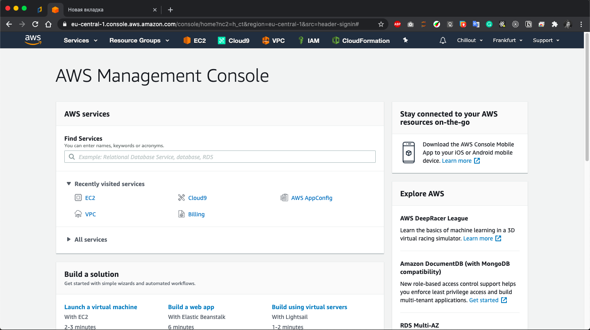
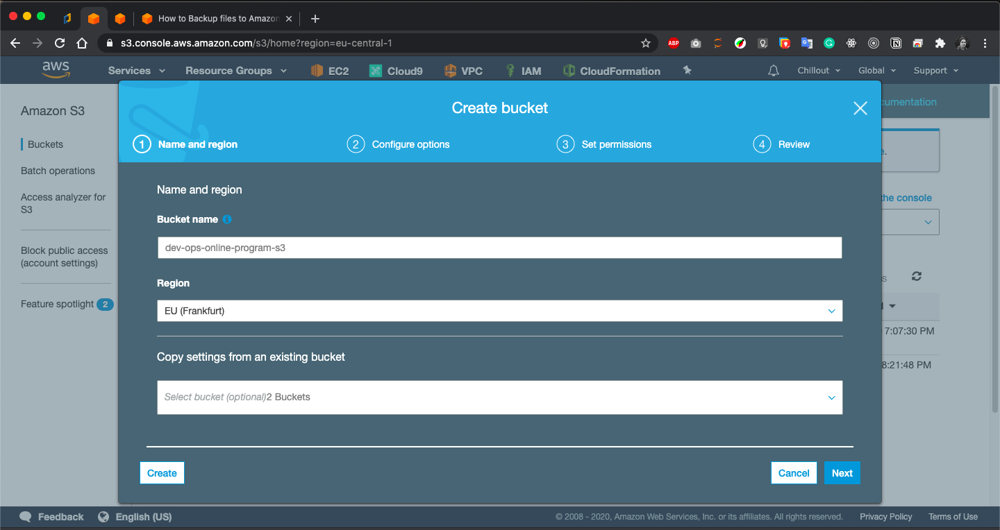
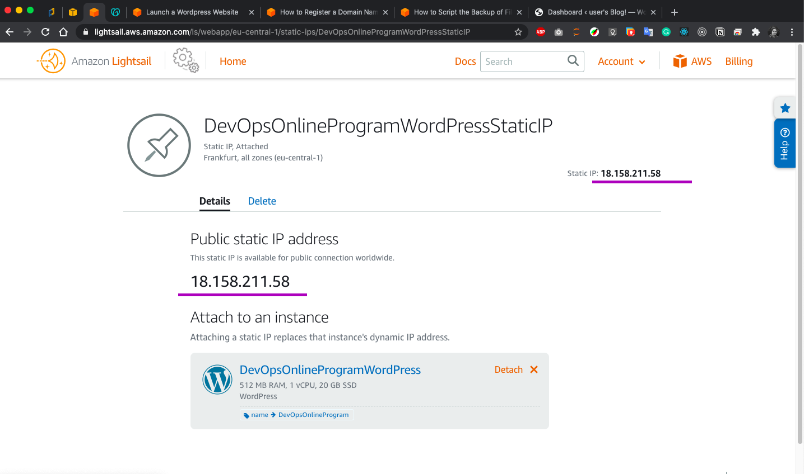

# Working with __AWS__

## Launching **Virtual Machine** on **AWS**

- ### Login to **AWS** as a **Root User**

- ### Go to **EC2**

- ### **Virtual Machine** Configuration process

- ### Connecting to **Virtual Machine** using **SSH**

## Using **Amazon Lightsail** for lauching **Instances**

- ### **Virtual Machine** Configuration process using **Amazon Lightsail**

___
> Subscribing to Service on **AWS Marketplace**

___
> Generating new **SSH key pair**

___

- ### Connecting to **Virtual Machine** using **SSH**

> Browser Terminal

> Custom Terminal

## **Store** / **Retrieve** files using **Amazon S3**

## **WordPress** Instance configuration using **Amazon Lightsail**

- ### **Amazon Lightsail** Wordpress Instance creation

- ### Connect to your instance via **SSH** and get the **password** for your **WordPress website**

- ### Getting Wordpress **Admin Password**

- ### Creating **Lightsail static IP** address for the **WordPress Instace**

- ### Creating **Lightsail DNS zone** for the **WordPress Instace**

## Working with IAM and AWS CLI

## Creating Amazon S3 **Static website**

## website link: https://theblockly.com

- ### Basic **System Structure**

- ### Setting up **S3 Bucket**

- ### Setting up **Route 53** DNS zone

- ### Setting up **Secure Connection** for our website 

- ### Setting up **CloudFront**

- ### Addig **CloudFront** record to **Route 53** DNS zone

- ### Checking **Secure Connection** to our website

## website link: https://theblockly.com

 

