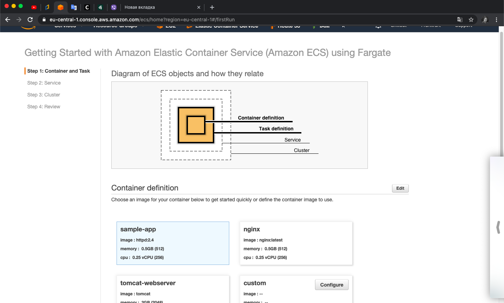

# Working with **Amazon  Elastic Container  Service  (Amazon  ECS)**

## Main **ECS** building blocks

## Setting up **ECS** 

## Load Balancer for **ECS** 

# Working with **Docker**

## Main Terms:
- ### Docker **Engine**
- ### Docker **Container**
- ### Docker **Image**
- ### **Dockerfile**

=======
 
