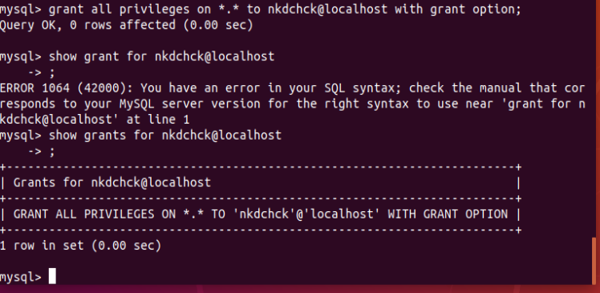

# Database Administration: **task 3.1**


## Main Terms

- ### Database
- ### Table
- ### Column
- ### Row
- ### Primary Key
- ### Foreign Key
- ### Compound Key
- ### Index
- ### Redundancy


## **1.** Download & Install MySQL server on VM

```bash
sudo apt-get install mysql-server
```


```bash
sudo apt-get install mysql-client
```


```bash
mysqladmin --version
```


```bash
sudo mysql
```


```bash
SHOW DATABASES;
```


```bash
sudo mysql -u root -p
```


## **2.** Create, Delete User Accounts and Grant Privileges

- ### Creating user


- ### Cheking privileges


> ### [Link to official MySQL Documentation on **Privileges**](https://dev.mysql.com/doc/refman/8.0/en/privileges-provided.html)

- ### Assigning Priviledges




- ### Deleting user


## **3.** Create a database on the server through the console

```bash
show databases;
```


```bash
create database my_database;
```


```bash
drop database my_database;
```


## **4.** Fill in tables

- ### Main data types


> ### CREATE TABLE teamstb1(column_name column_type)

```bash
CREATE TABLE teamstb1(
    team_id INT NOT NULL AUTO_INCREMENT,team_name VARCHAR(100) NOT NULL,team_captain VARCHAR(40) NOT NULL,establishment_date DATE,PRIMARY KEY ( team_id )
    );
```

```bash
CREATE TABLE resultstb1(
    result_id INT NOT NULL AUTO_INCREMENT,
    team_id INT NOT NULL,
    result_type VARCHAR(4) NOT NULL,
    game_date DATE,
    PRIMARY KEY ( result_id )
    );
```


> ### INSERT INTO table_name ( field1, field2, field3 ) VALUES ( value1, value2, value3 );

```bash
INSERT INTO teamstb1 
(team_name, team_captain, establishment_date)
VALUES
('Dinos', 'Nick Sergienko', '2020-05-06');

INSERT INTO resultstb1 
(team_id, result_type, game_date)
VALUES
(3, 'Draw', '2020-07-08');
```


```bash 
SELECT * from teamstb1
```


## **5.** Describe the database schema, (minimum 3 tables)

### Importing two sample databases to our MySQL Server
> ### Original tutorials for sample databases:
> - [Employees Sample Database](https://dev.mysql.com/doc/employee/en/sakila-structure.html)
> - [MySQL Sample Database](https://www.mysqltutorial.org/mysql-sample-database.aspx)

- ### **employees.slq** Schema


- ### **classicmodels.slq** Schema


## **6.** Execute SQL queries DDL, DML, DCL

### **SELECT** [ what to select ] **FROM** table(s) **WHERE** [ conditions that data must satisfy ];


### Comparison operators are: **<  <=  =  !=  <>  >=  >**


### Logical operators are: **AND OR NOT**


### Comparison operator for special value **NULL**: **IS**


```bash
CREATE TABLE crowds_tb1(
    game_id INT NOT NULL,
    game_date DATE NOT NULL,
    crowd_count INT NOT NULL,
    total_sales DOUBLE(12,2) NOT NULL DEFAULT 0.00
    );
```

CREATE TABLE `clone_teamstb1` (
  `team_id` int(11) NOT NULL AUTO_INCREMENT,
  `team_name` varchar(100) NOT NULL,
  `team_captain` varchar(40) NOT NULL,
  `establishment_date` date DEFAULT NULL,
  PRIMARY KEY (`team_id`),
  KEY `date_of_est` (`establishment_date`),
  KEY `name_of_the_team` (`team_name`)
) ENGINE=InnoDB AUTO_INCREMENT=7 DEFAULT CHARSET=latin1;


### **7.** Make a selection from the main table DB MySQL


 


