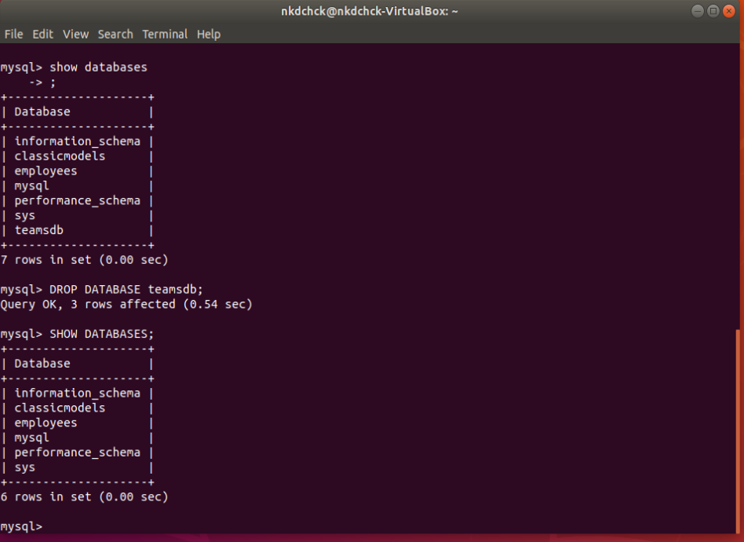
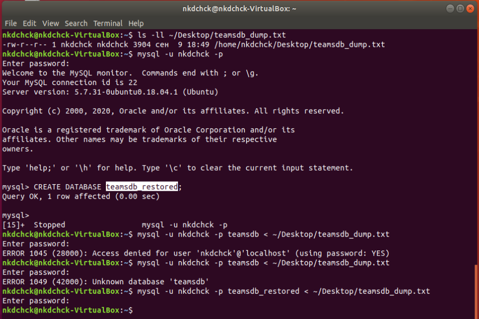
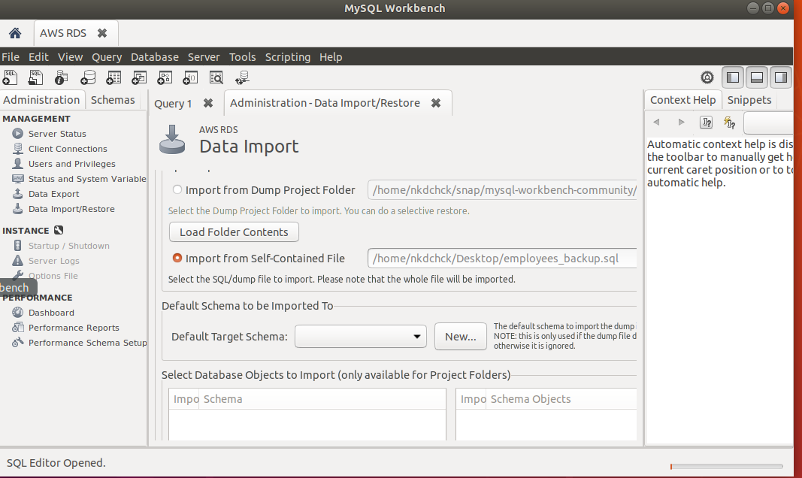

# Database Administration: **task 3.2**

## **1.** Make backup of your database

## **2.** Delete the table and / or part of the data in the table
- ### Dropping table

- ### Reastoring table

- ### Dropping database

- ### Restoring database

## **3.** Creating Backups

## **4.** Transfer your local database to RDS AWS

- ### Connecting to RDS with MySQL Workbench

 

