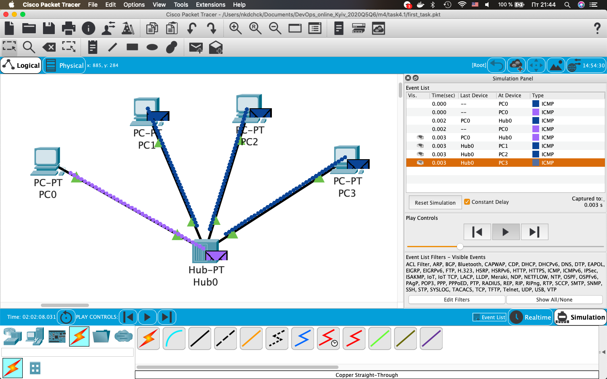
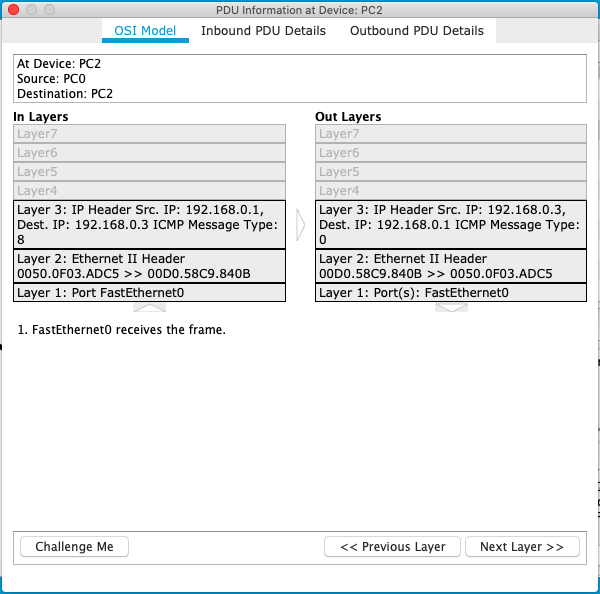

# Networking Fundamentals: **task 4.1** (Dubenchuk Nikita)

---

--- 

---

## VLAN

## Fault-tolerant communication channels

- ### Connection redundancy (STP)

- ### Link aggregation (EtherChannel: LACP)

## Accessing networking equipment (Switch)

- ### Connecting to the **console**

- ### Setting **password** for the **"priviledge" mode** (enable)

- ### Creating **user**

- ### Setting up **console authorization**

- ### **IP address** setup

- ### Choosing **remote connection** type (Telnet/SSH)

- ### Setting up **remote access**

