# Linux Essentials: **task 5.1** (Dubenchuk Nikita)

## Setting up Linux Virtual Machine in VirtualBox

- ### Also establishing **ssh connection** from terminal and creating separate **tmux session** called **"linuxtask"**

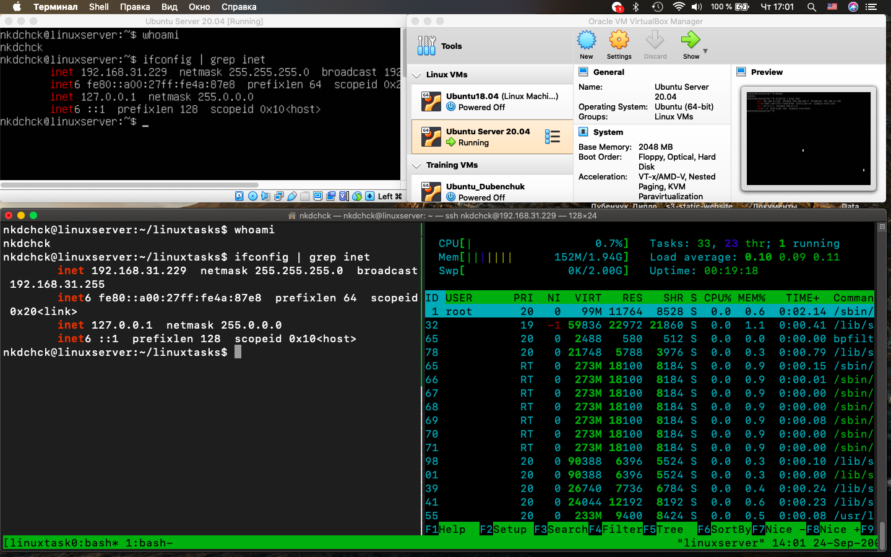

## *Creating/Switching between* **virtual terminals**

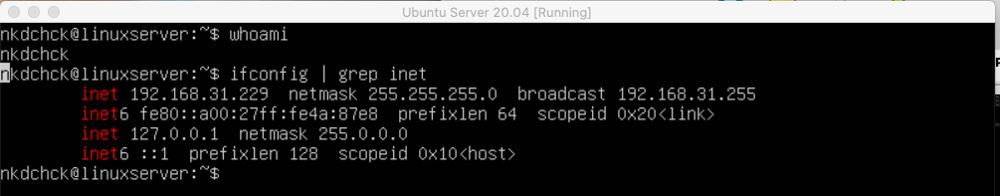
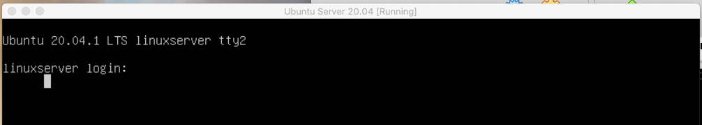
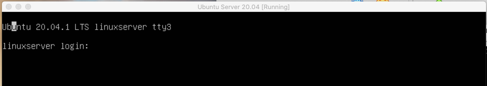

## Cheking out environment variables using **printenv** command

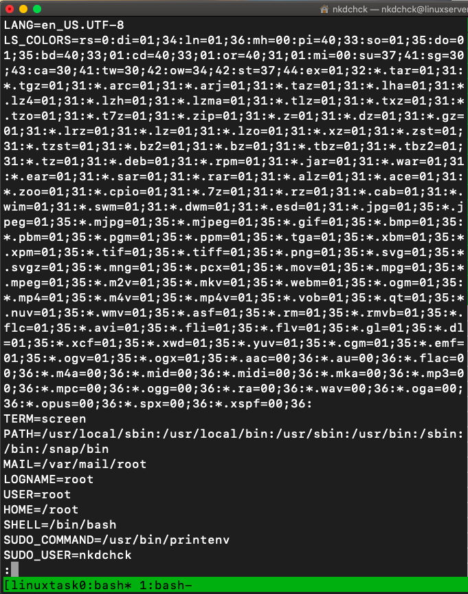
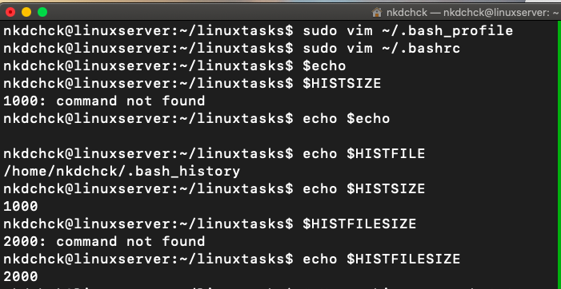

## Cheking out content of **/etc/profile**, **~/.bashrc** and **~/.bash_profile** usig **Vim**

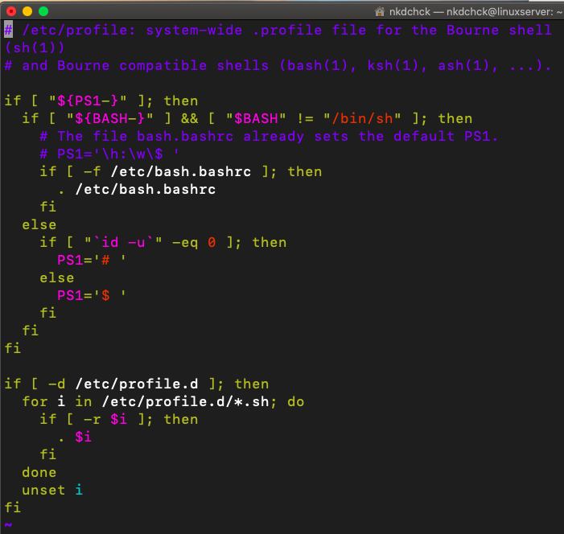
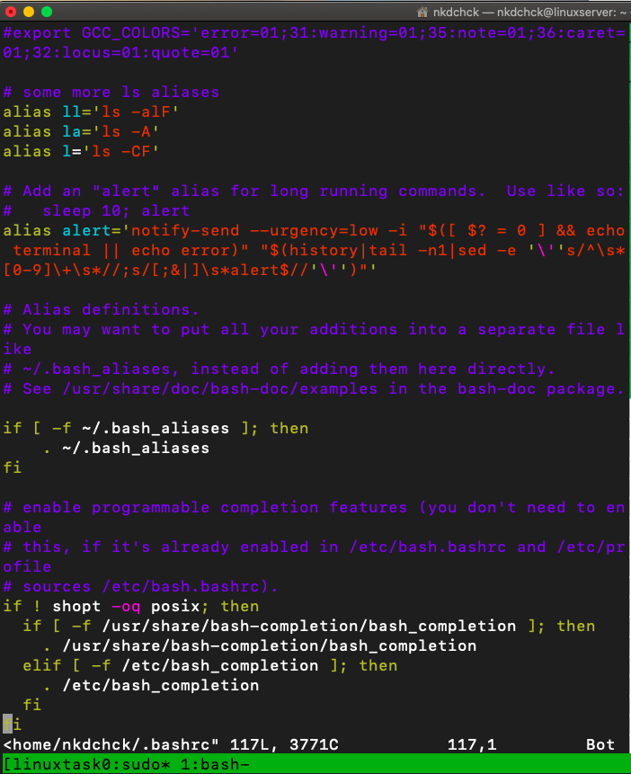
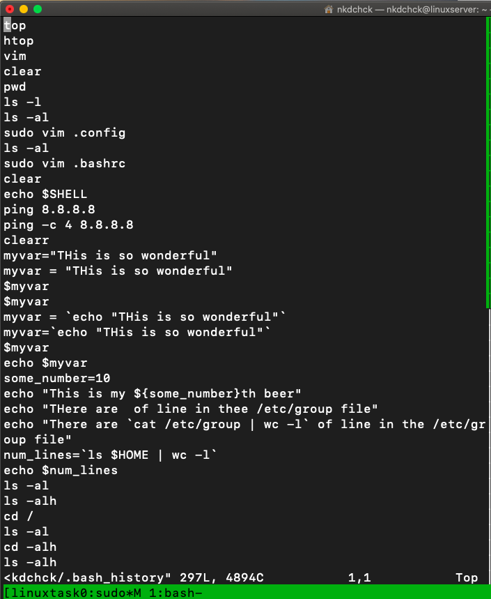

- ### Also installing extra **plugins** for **Vim** using **Vundle** and adding some **extra settings** into **.vimrc** file

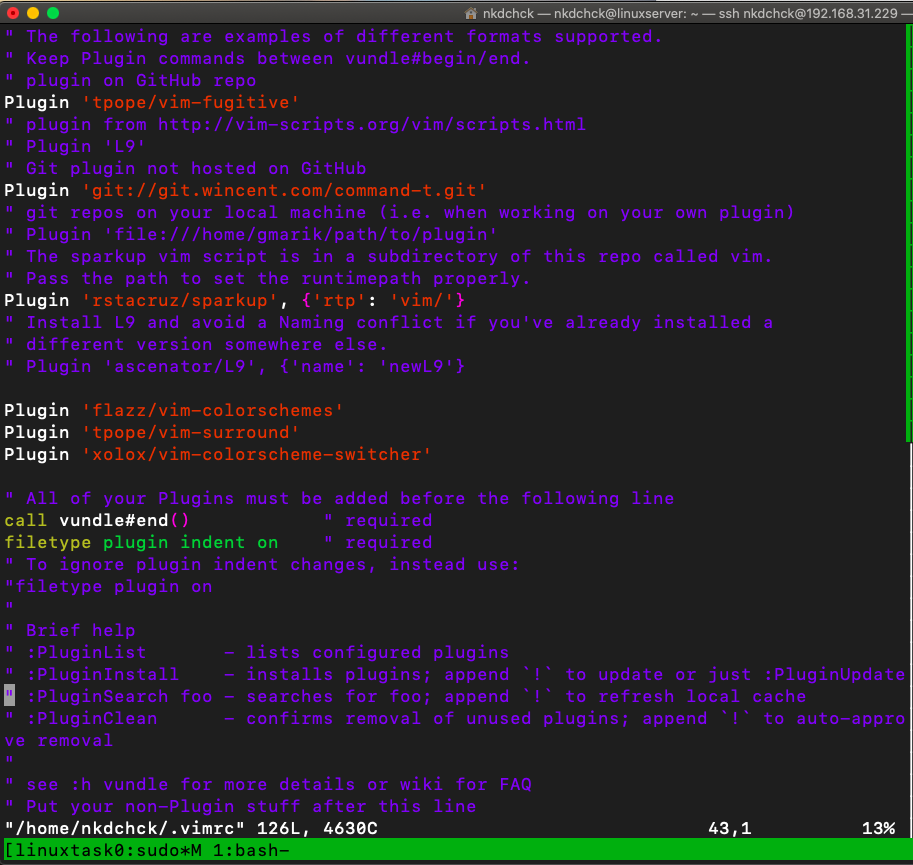
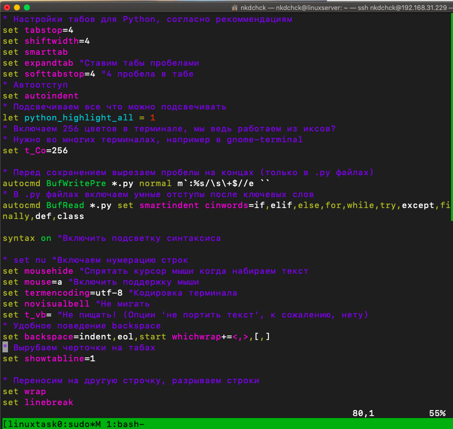

## Using **who**, **w**, **whoami**, **id**

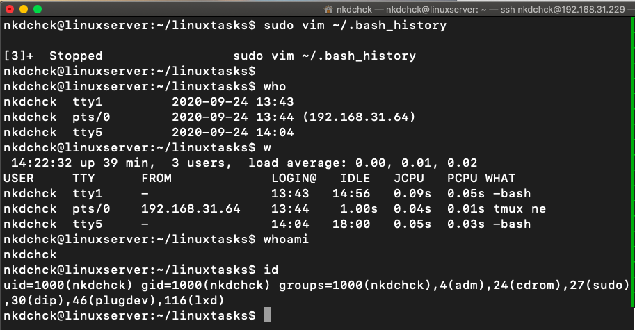