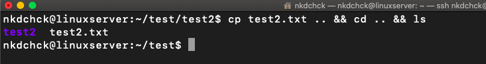

# Linux Essentials: **task 5.2** (Dubenchuk Nikita)

> ## Checking current directory

```bash
$ pwd
```


> ## List **/ directory** contents using **long listing format**

```bash
$ ls -l /
```


> ## List contents in **current directory**

```bash
$ ls
```


> ## List contents in **current user directory**

```bash
$ ls ~
```


> ## List contents in **current directory** using **long listing format**

```bash
$ ls -l
```


> ## List contents in **current directory** and **don't ignore** entries starting with **.** (hidden files)

```bash
$ ls -a
```


> ## List contents in **current directory** using **long listing format** and **don't ignore** entries starting with **.** (hidden files)

```bash
$ ls -al
```


> ## List **provided directory** using **long listing format** and **don't ignore** entries starting with **.** (hidden files)

```bash
$ ls -ald ~
```


> ## Creating **test** directory using **mkdir** command

```bash
$ mkdir test
```


> ## Going into **test** directory using **cd** command and executing **pwd** to check current working directory

```bash
$ cd test/ && pwd
```


> ## Creating **test.txt** file using **touch** command and listing it using **long listing format**

```bash
$ touch test.txt && ls -l test.txt
```


> ## Creating **test2** folder using **mkdir** command and moving **test.txt** file there using **mv** command (**-v** flag stands for **verbose**)

```bash
$ mkdir test2 && mv -v test.txt test2
```


> ## Going into **test2** directory and check out its contents

```bash
$ cd test2/ && ls
```


> ## Change **test.txt** file name to **text2.txt** using **mv** command and list **current directory** contents

```bash
$ mv test.txt test2.txt && ls
```


> ## Copy **test2.txt** file one directory higher using **cp** command and then go there using **cd ..** command, also list **current directory** contents
```bash
$ cp test2.txt .. && cd .. && ls
```



> ## Deleting **test2.txt** file and **test2** folder using **rm** command (**-r** flag stands for **recursively**)
```bash
$ rm test2.txt && rm -r test2
```


- ## **more** - To view a text file one page at a time, press spacebar to go to the next page

> ## Show the document one page at a time

```bash
$ more filename
```

> ## Show the document page few lines as specified by **(-num)**

```bash
$ more -num filename
```
> ## **more -10 filename** will show 10 lines for every page

```bash
$ more -10 filename
```

- ## **less** - Much the same as **more** command except:

### a) You can navigate the page up/down using the less command and not possible in more command.

### b) You can search a string in less command. (use /keyword to search)

### c) “more” was fairly limited, and additional development on “more” had stopped

### d) it uses same functions as vi editor


> ## Example usage

```bash 
$ less filename
```


- ## **cat** - Can be used to join multiple files together and print the result on screen (it will not show page by page)

> ## To displat the contents of file **test.txt**

```bash 
$ cat test.txt
```

> ## To display the contents of both files

```bash 
$ cat test.txt test2.txt
```

> ## Read test.txt and test2.txt, then combine those files to make test3.txt

```bash 
$ cat test1.txt test2.txt > test3.txt
```

- ## To read **docs** for certain command we can use **man**

> ## For example, lets see documentation for **rm** command

```bash 
$ man rm
```


