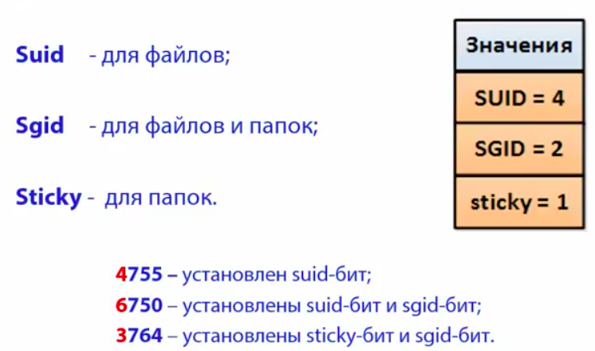
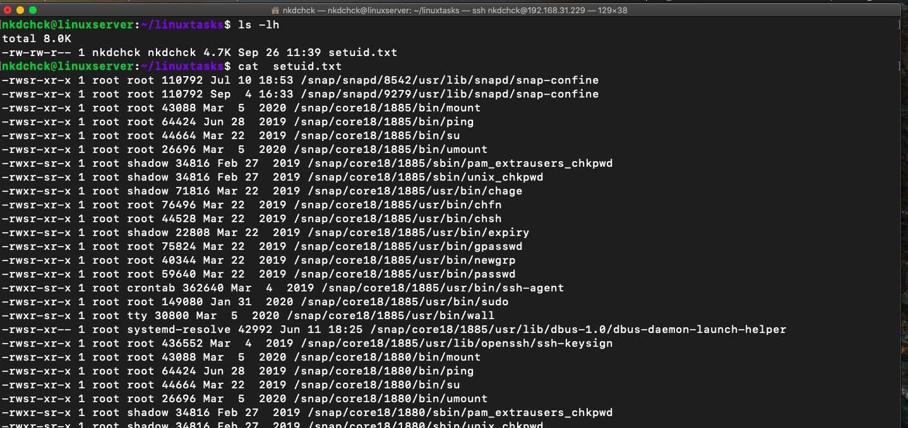
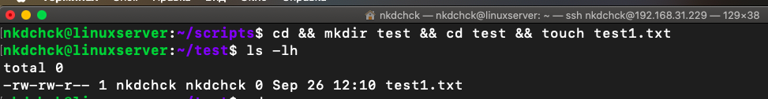
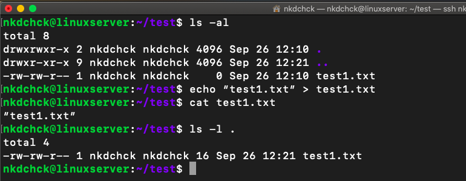
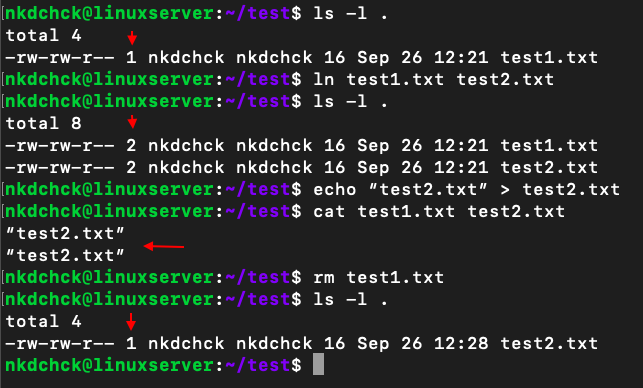
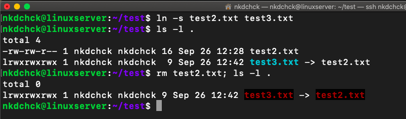
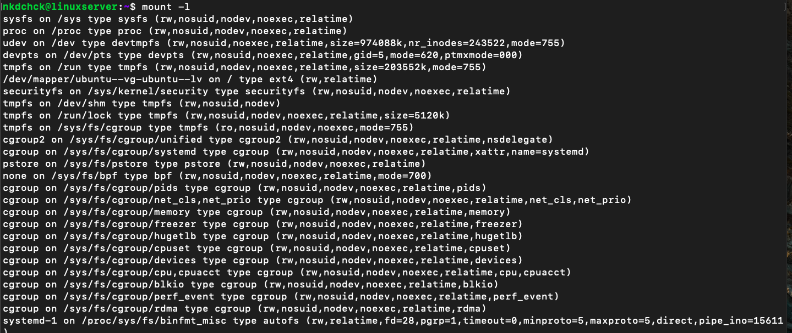
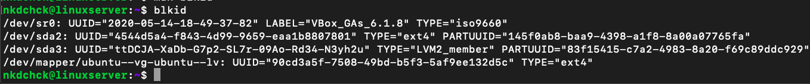
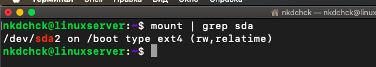
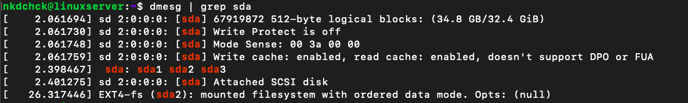

# Linux Essentials: **task 5.3** (Dubenchuk Nikita)

> ## Using **find** command to discover files with active sticky bits



```bash
$ sudo find / -perm /6000 -type f -exec ls -ld {} \;>setuid.txt
```

- ## Using this command our goal is to find all the **files** (`-type f`) on our machine with permissions set to `6000` (`-perm /6000`) and execute `ls -ld` command on each of them. Finaly redirect **STDOUT** into **setuid.txt** file. 
- ## `{}` in `exec ls -ld {} \;` is a placeholder for `find` command results. 
- ## `\;` is just to show the end of `-exec` command. It is possible to use `+` symbol instead




> ## Go to users home (`/home/<username>`) directory(`cd`), create `test` directory (`mkdir test`) and go into it (`cd test`). Finally create `test1.txt` file there using `touch` command.

```bash
$ cd && mkdir test && cd test && touch test1.txt
```


> ## Redirect `echo` command **STDOUT** into `test1.txt` file, preview file using `cat` command and list `current folder` (`.`) contents with `ls` command using long listing format (`-l`) 

```bash
$ ls -al
$ echo “test1.txt” > test1.txt
$ cat test1.txt
$ ls -l .
```



> ## Creating `hard` link using `ln` command, then examine number of link to `test1.txt` and `test2.txt` files using `ls -l .` command. Redirect `echo` command **STDOUT** into `test2.txt` file, preview both `test1.txt` and `test2.txt` files using `cat` command (contents should be the same). Finally delete `test1.txt` file (by doing that we destroy our hard link) and check out number of link to remaining `test2.txt` file.

```bash
$ ls -l .
$ ln test1.txt test2.txt
$ ls -l .
$ echo “test2.txt” > test2.txt
$ cat test1.txt test2.txt
$ rm test1.txt
$ ls -l .
```



> ## Creating `soft` or `symbolic` link using `ln` command with `-s` flag, then examine number of link to `test2.txt` and `test3.txt` files using `ls -l .` command. Finally delete `test2.txt` file (by doing that we ended up with a broken link) and list `current folder` (`.`) contents with `ls` command using long listing format (`-l`) to see broken link, wich should be highlighted in some way or another (in our case it is highlited with red color)

```bash
$ ln -s test2.txt test3.txt
$ ls -l .
$ rm test2.txt; ls -l .
```



> ## The following command lists all mounted filesystems. The option `-l` adds labels to this listing.

```bash
$ mount
```


> ## `blkid` commmand can determine the type of content (e.g. filesystem or swap) that a block device holds, and also the attributes (tokens, NAME=value  pairs)  from the content metadata (e.g. LABEL or UUID fields)

```bash
$ blkid
```



> ## Execute `mount` command to get info abount mounted file systems, then search for `sda` keyword using `grep` command and output search results to the terminal.

```bash
$ mount | grep sda 
```



> ## The default action of `dmesg` is to display all messages from the kernel ring buffer. In this case we execute `dmesg` command, then search for `sda` keyword using `grep` command and output search results to the terminal.

```bash
$ dmesg | grep sda 
```



> ## Using this command we search following all symbolic links (unlike `-r`) for `all` files wich match our regular expression (-e "root") under each directory `recursively` in `/etc` folder. Finally, we redirect **STDOUT** to the `root_entries.txt` file.

```bash
$ sudo grep -R -e “root” /etc > root_entries.txt  
```


