# Linux Essentials: **task 5.4** (Dubenchuk Nikita)

> ## Creating a new user by the name `"user"`
- ### Creating group called `user`
- ### Creting new user by the name `user`, add this user to the group `user`, set default shell to `/bin/bash` and create directory in `home` folder for the new user
- ### Cheking new users info in `/etc/passwd`
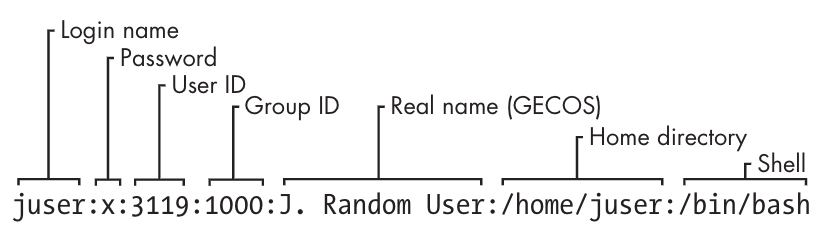
- ### Setting up password for the new user using `passwd` command
- ### Cheking new users `UID` `GID` and list of all the groups with ids using `id` command
- ### Cheking info(permissions, users, goups etc.) about new user folder

```bash
$ sudo groupadd user
$ sudo useradd -g user -s /bin/bash -d /home/user -m user
$ cat /etc/passwd | grep user
$ sudo passwd user
$ id user
$ ls -ld /home/user
```
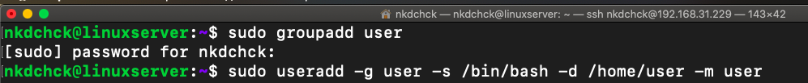
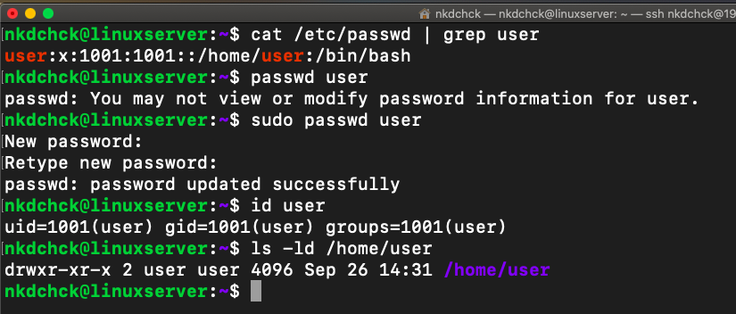

> ## Adding new user to `sudo` group
```bash
$ sudo usermod -aG sudo user
```
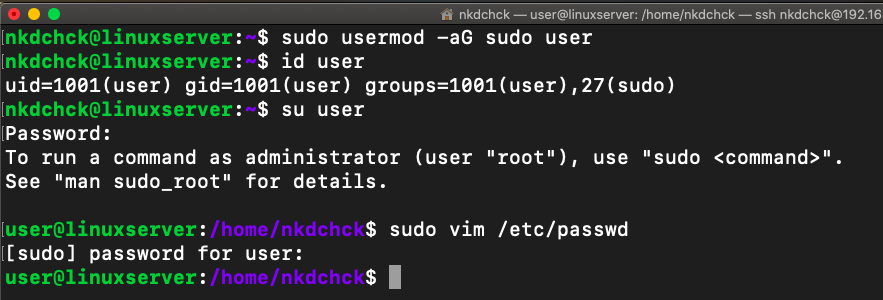

> ## Editing `/etc/passwd` to prevent user `user` from logging in to the system
```bash
$ sudo usermod -aG sudo user
```
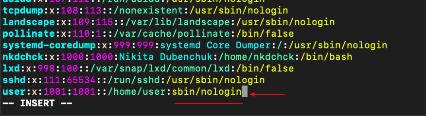
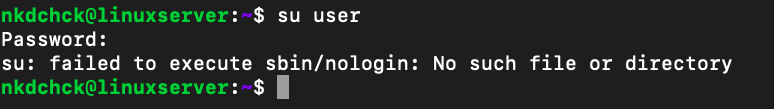

> ## Looking through the contents of `/etc/passwd` and `/etc/group`

```bash
$ cat /etc/passwd
$ less /etc/group
```
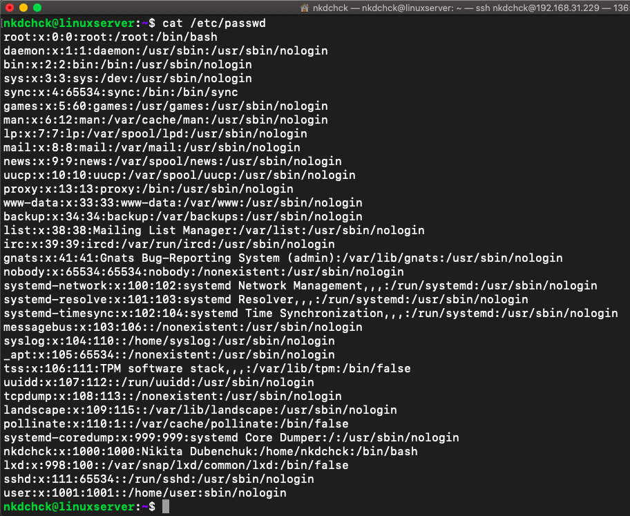
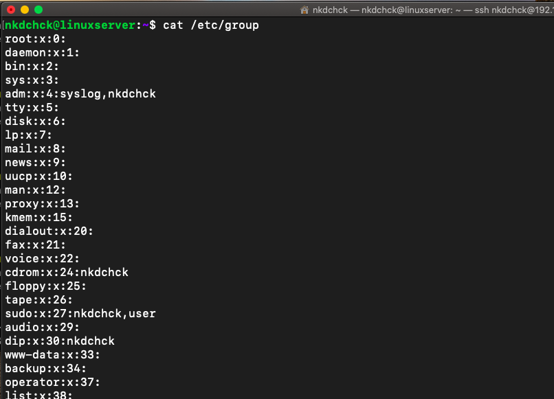

> ## Getting data from `/etc/passwd` and `/etc/group` about users: `root`, `guest`, `user` using `grep` command to search for templates

```bash
$ cat /etc/group | grep -e root -e guest -e user
$ cat /etc/passwd | grep -e root -e guest -e user
```

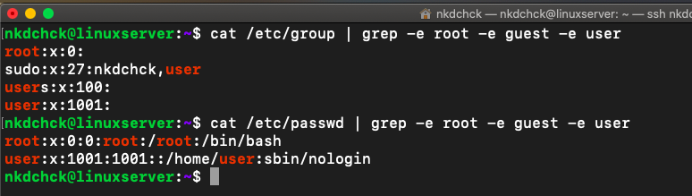

> ## Parsing `/etc/passwd` and `/etc/group` with `cut` command

- ### Getting user `names` from `/etc/passwd` (`-d:` - separate on `:`, `-f1` - get the first position in each string)

```bash
$ cut -f1 -d: /etc/passwd
```

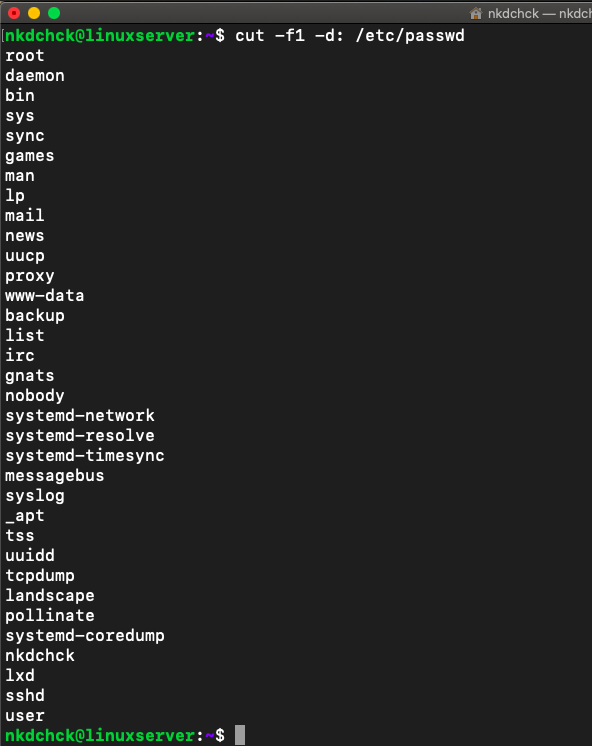

- ### Getting user `names` and `password` from `/etc/passwd`

```bash
$ cut -f1,2 -d: /etc/passwd
```

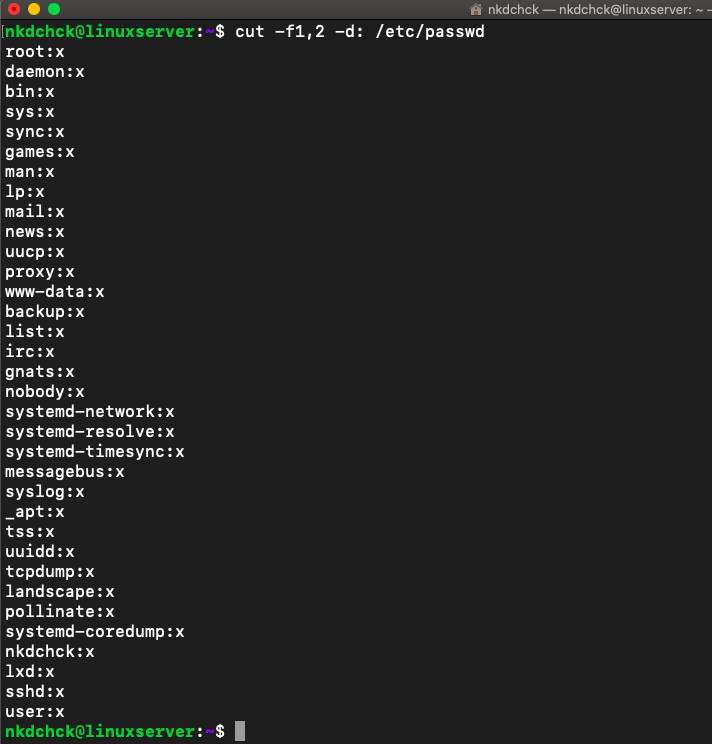


- ### Getting user `names` and `default shell` from `/etc/passwd`

```bash
$ cut -f1,7 -d: /etc/passwd
```

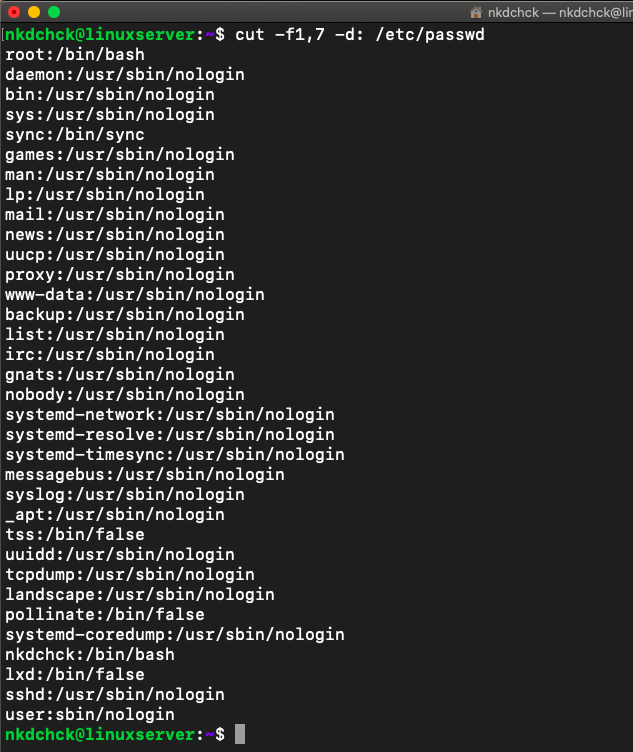


- ### Getting `names` of all the `groups`

```bash
$ cut -f1 -d: /etc/group
```

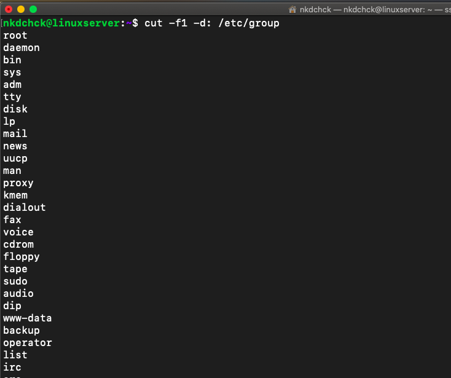


- ### Getting `names` and `passwords` of all the `groups`

```bash
$ cut -f1,2 -d: /etc/group
```

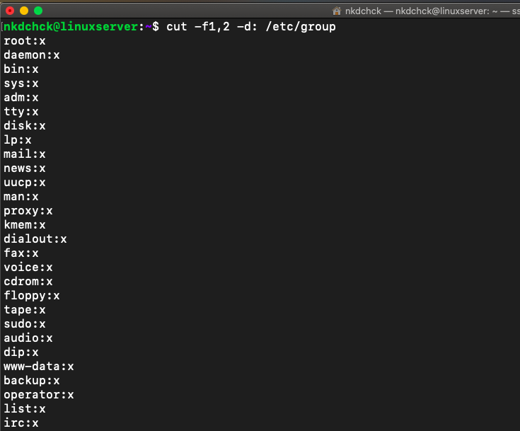


> ## Try to call `less` on `/etc/shadow`

```bash
$ man -k shadow
$ man 5 shadow
$ sudo less /etc/shadow
```

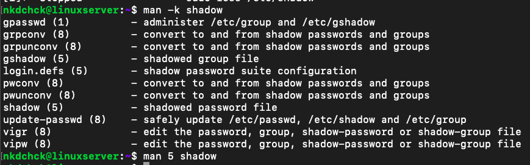
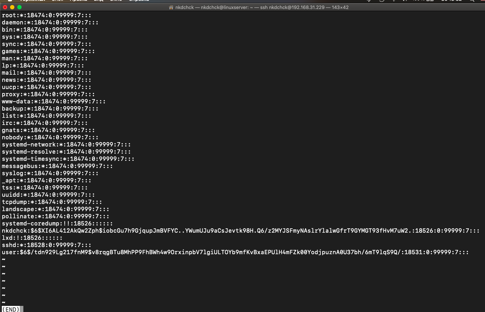

> ## Dealing with `chmod` command

```bash
$ sudo vim
$ sudo chmod +x script.sh
$ ls -alh
```

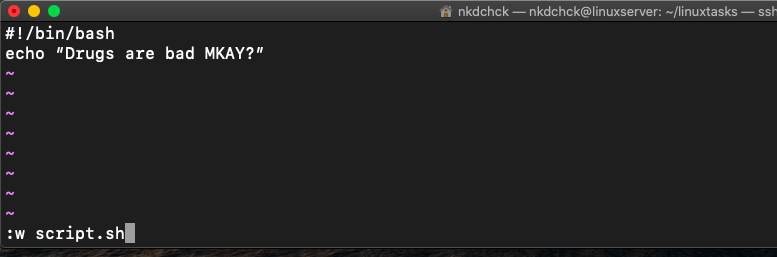
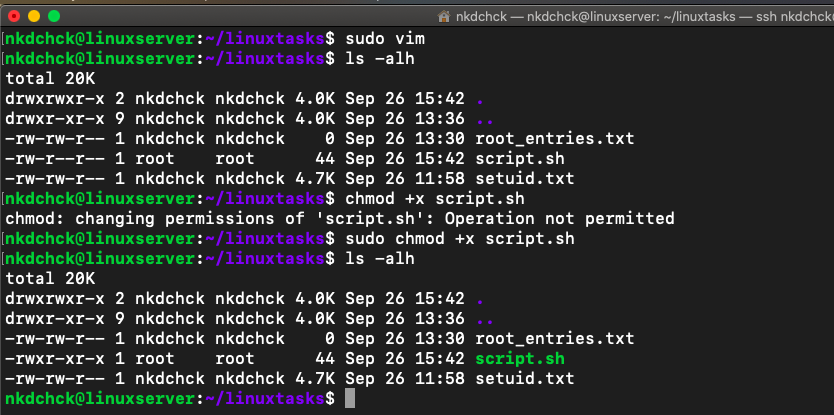


> ## Prohibit user `user` from visiting `testDir` directory

```bash
$ ls -lh
$ chmod o-rx testDir/
$ ls -lh
$ sudo vim /etc/passwd
$ su user
$ ls -lh
$ cd testDir/
```

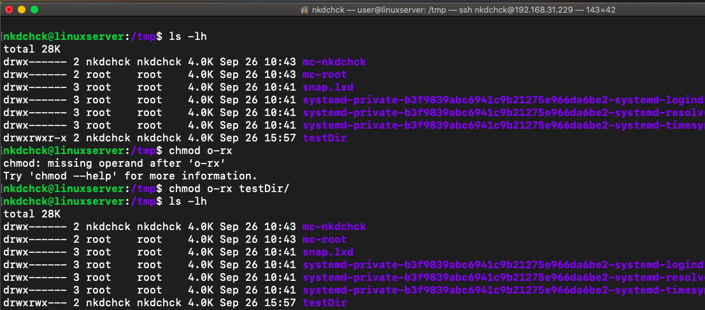
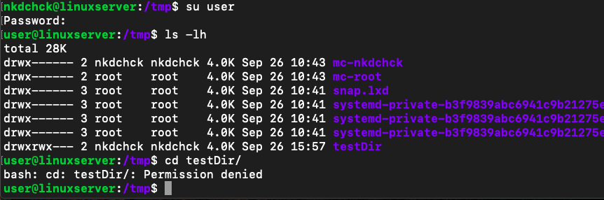


> ## Forbid an owner of some file to read to or write from this file

```bash
$ ls -lh testDir/testFile.txt
$ sudo chmod u-rw testDir/testFile.txt
$ ls -lh testDir/testFile.txt 
$ echo "Owner can't read/write from this file" > testDir/testFile.txt
```

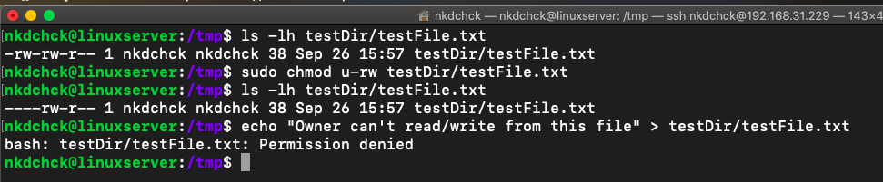


