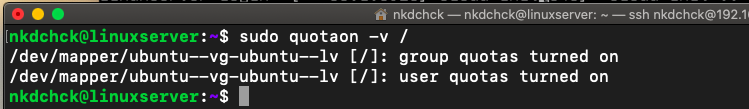

# Linux Essentials: **task 5.5** (Dubenchuk Nikita)

- ## Setting up user `quotas`
```bash
$ sudo apt-get update && sudo apt-get install quota
```


```bash
$ sudo quota --version
```


- ## On a cloud-based virtual server, your default Ubuntu Linux installation may not have the kernel modules needed to support quota management. To check, we will use `find` to search for the `quota_v1` and `quota_v2` modules in the `/lib/modules/...` directory

```bash
$ find /lib/modules/`uname -r` -type f -name '*quota_v*.ko*'
```


> ## If you get no output from the above command, install the `linux-image-extra-virtual` package

```bash
$ sudo apt install linux-image-extra-virtual
```


- ## Updating Filesystem Mount Options

> ## To activate `quotas` on a particular filesystem, we need to mount it with a few quota-related options specified. We do this by updating the filesystem’s entry in the `/etc/fstab` configuration file

```bash
$ sudo nano /etc/fstab
```

> ## Updating the line pointing to the `root` filesystem by replacing the `defaults` option with `usrquota/grpquota` options. This change will allow us to enable both `user`- (`usrquota`) and `group-based` (`grpquota`) quotas on the filesystem. If you only need one or the other, you may leave out the unused option. If your `fstab` line already had some options listed instead of `defaults`, you should add the new options to the end of whatever is already there, being sure to separate all options with a comma and *`no` spaces


- ## Remount the `filesystem` to make the new options take effect

```bash
$ sudo mount -o remount /
```

- ## Verifying that the new options were used to mount the filesystem by looking at the `/proc/mounts` file

```bash
$ cat /proc/mounts | grep ' / '
```


- ## Enabling Quotas

> ### This command creates the files `/aquota.user` and `/aquota.group`. These files contain information about the `limits` and `usage` of the `filesystem`, and they need to exist before we turn on quota monitoring. The `quotacheck` parameters we’ve used are:

- ### `u`: specifies that a `user-based` quota file should be created
- ### `g`: indicates that a `group-based` quota file should be created
- ### `m`: disables remounting the filesystem as read-only while performing the initial tallying of quotas. Remounting the filesystem as read-only will give more accurate results in case a user is actively saving files during the process, but is not necessary during this initial setup

```bash
$ sudo quotacheck -ugm /
$ sudo ls / | grep aquota.*
```


- ## Turn on the `quota` system

```bash
$ sudo quotaon -v /
```
> ### Server is now monitoring and enforcing `quotas`




- ## Configuring `quotas` for `utest` user (using `edquota` or `setquota`)

> ### Using `edquota` to set quota for `utest` user

```bash
$ sudo edquota -u utest
$ sudo quota -vs utest
```


 

> ### Using `setquota` to set quota for `utest` user

```bash
$ sudo setquota -u utest 100M 150M 0 0 /
$ sudo quota -vs utest
```


- ## Generating `Quota Reports`

```bash
$ sudo repquota -s /
```


- ## Configuring a Grace Period for Overages

```bash
$ sudo setquota -t 864000 864000 /
```

> ### The above command sets both the `block` and `inode` grace times to `864000 seconds`, or `10 days`. This setting applies to all users, and both values must be provided even if you don’t use both types of quota (block vs. inode)


- ## Testing `Quata` settings(exceeding `soft` limit of `100M`)


