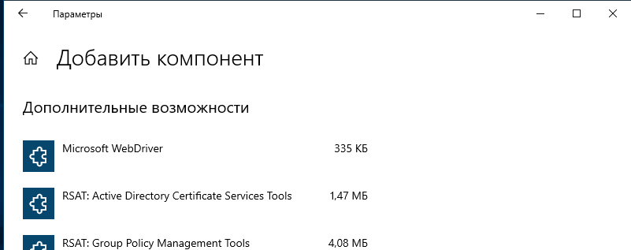
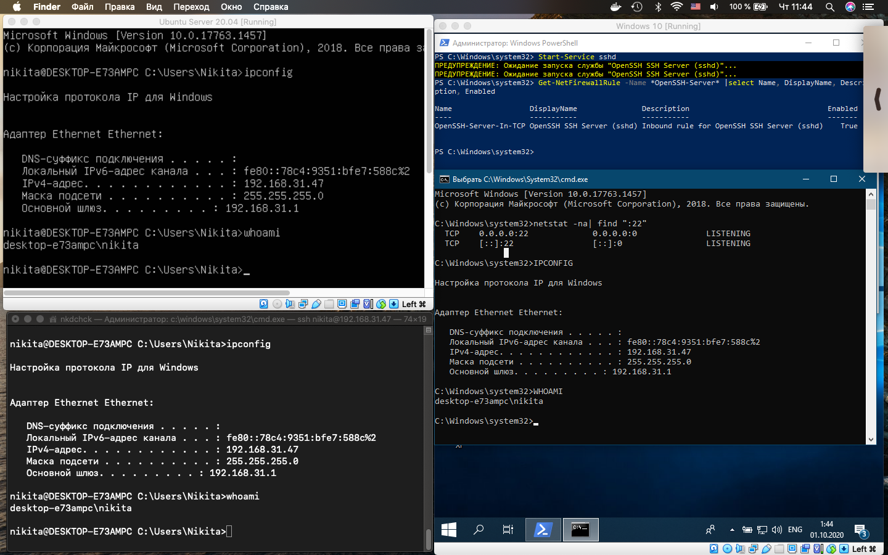

# Linux Essentials: **task 5.7** (Dubenchuk Nikita)

### Setting up **SSH Server** on **Windows**
```PowerShell
Add-WindowsCapability -Online -Name OpenSSH.Server*
Get-WindowsCapability -Online | ? Name -like 'OpenSSH.Ser*'
```


> On **Windows 10** it is possible to install **OpenSSH Server** from Contol Panel




```PowerShell
Set-Service -Name sshd -StartupType 'Automatic'
Start-Service sshd
```





### Main **OpenSSH Server** components are located in this catalogs

- ### OpenSSH executables: `C:\Windows\System32\OpenSSH\`
- ### Config file sshd_config: `C:\ProgramData\ssh\`
- ### OpenSSH journal: `C:\ProgramData\ssh\logs\sshd.log`
- ### authorized_keys file and keys: `~\.ssh\`
- ### When installed, `OpenSSH Server` creates new `sshd` user


### Some of `sshd_config` settings:

- ### Acces using Keys
```PowerShell
PubkeyAuthentication yes
```
- ### Access using password
```PowerShell
PasswordAuthentication yes
```
- ### Access without password
```PowerShell
PermitEmptyPasswords no
```
- ### It is possible to change port on wich OpenSSH Server is listening:
```PowerShell
Port 2222
```


### `Start`, `Stop` или `Restart` service


```PowerShell
Start-Service sshd
Stop-Service sshd
Restart-Service sshd
```

### To delete `OpenSSH Server` and `Client`

```PowerShell
Remove-WindowsCapability -Online -Name OpenSSH.Server~~~~0.0.1.0
Remove-WindowsCapability -Online -Name OpenSSH.Client~~~~0.0.1.0
```


### Setting up **SSH Server** on **Linux**

```Bash
sudo apt-get update
sudo apt-get install openssh-server
sudo apt-get install openssh-client
```

### Most common commands (Start, Stop, Restart etc.)

```Bash
sudo systemctl start sshd.service
sudo systemctl stop sshd.service
sudo systemctl restart sshd.service
sudo systemctl status sshd.service
sudo systemctl enable sshd.service
sudo systemctl disable sshd.service
```

> In Linux OpenSSH Server settings file is located here: `/etc/ssh/sshd_config`

> It is a good practice to create a copy of the derault configuration file before any changes applied. You can do it using this command:

```Bash
sudo cp /etc/ssh/sshd_config /etc/ssh/sshd_config.origs
sudo chmod a-w /etc/ssh/sshd_config.original
```

### Setting up Authentication using **SSH keys**

```Bash
ssh-keygen -t dsa
ssh-copy-id username@remotehost
chmod 600 .ssh/authorized_keys
```


### Choosing Secure `SSH-Keys`

- ### This generates an RSA key pair using a `2048 bit` key

```Bash
ssh-keygen -t rsa
```

- ### The `4096 key` is used to secure the communication channel between the client and the server or server and client. It is secure but also comes with an overhead in CPU time on both server and client to encrypt and decrypt with the bigger key

```Bash
ssh-keygen -t rsa -b 4096
```

- ### Lets test difference in time. Doubling the key size more than doubles the complexity of the key encryption 

```Bash
openssl speed rsa1024 rsa2048 rsa4096
```


- ### Preventing our SSH Key from Brute-Forcing, for this we can encrypt the private keys multiple times (250 rounds in our case)


```Bash
ssh-keygen -t rsa -b 4096 -o -a 250
```

- ### We can use another encryption protocol as well

```Bash
ssh-keygen -t ed25519  -o -a 250
```


### Implementing `Port Forwarding` for the ssh client from the host machine to the guest machine behind `NAT`


