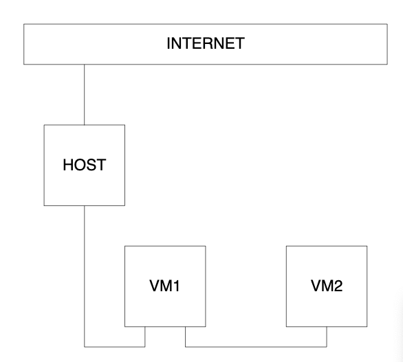
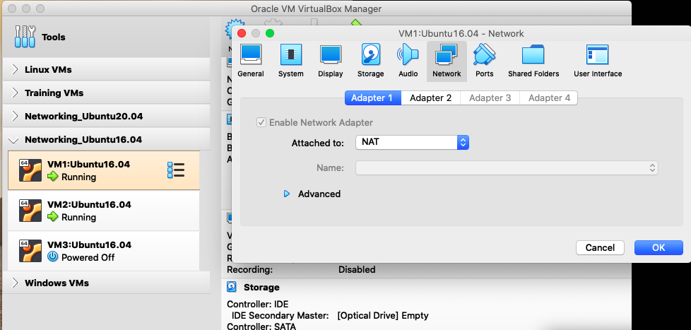
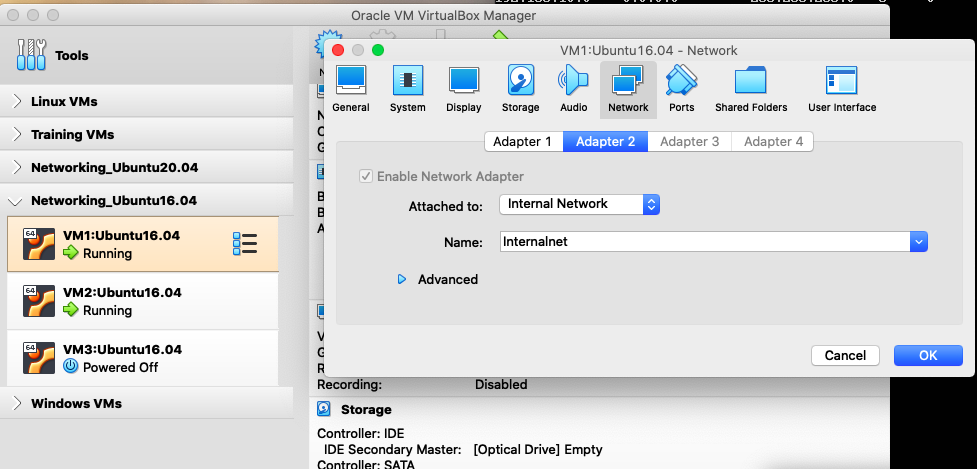
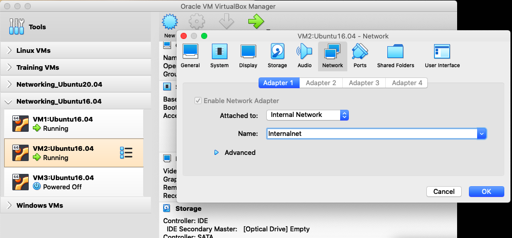
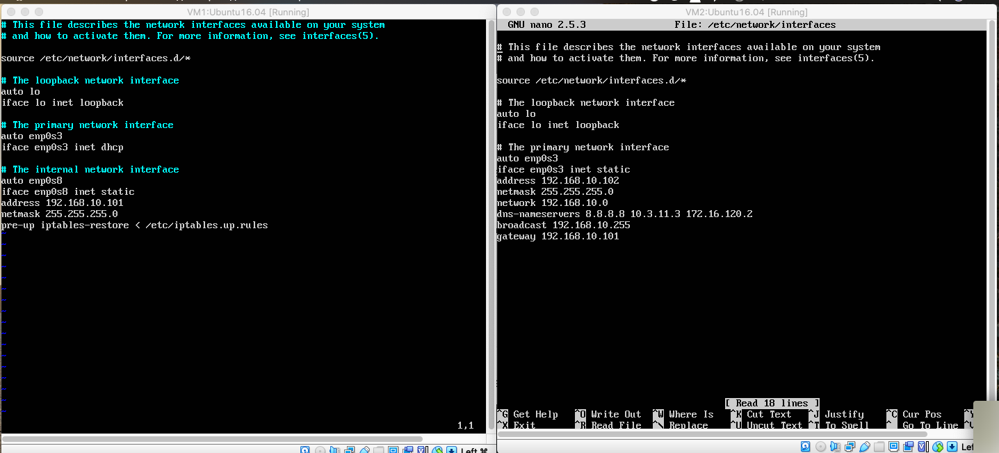
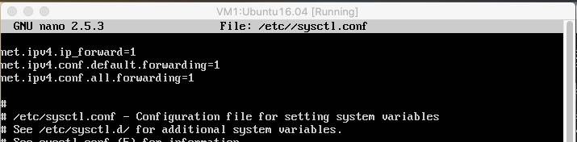
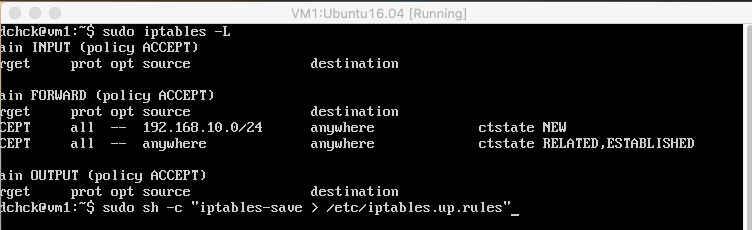
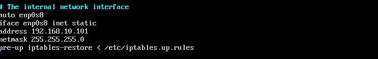
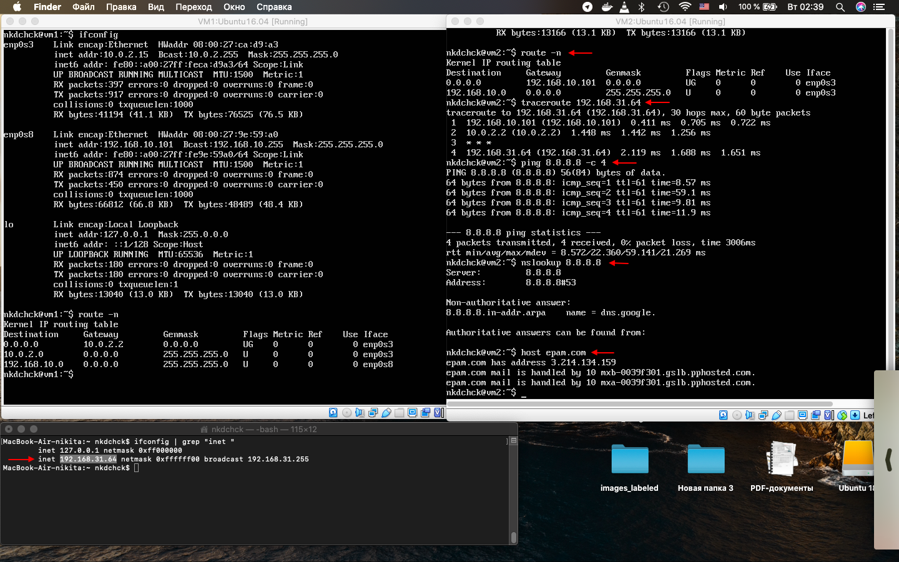
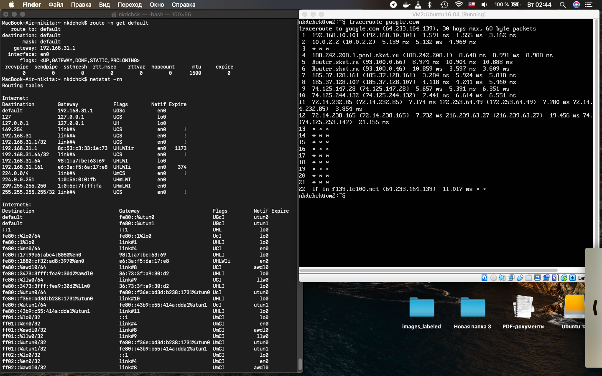

# Networking using Linux: **task 6.1** (Dubenchuk Nikita)

## Network Settings for `VM1` and `VM2`

- ### **VM1** - `NAT` interface + `Internal network` internal

- ### **VM2** - `Internal network` interface

> ### Goal is to make `VM2` has an access to the Internet (iptables, forward, masquerade)

## Setting up `Network Interfaces`

## Adding `IP Forwarding` and `iptable rules` for `VM1`, also adding record to make iptable settings permanent

## Remaining steps: 
- ### 3, 4, 5, 6

- ### 7, 8

