# Networking using Linux: **task 6.2** (Dubenchuk Nikita)

# Install and configure `DHCP server` on `VM1`

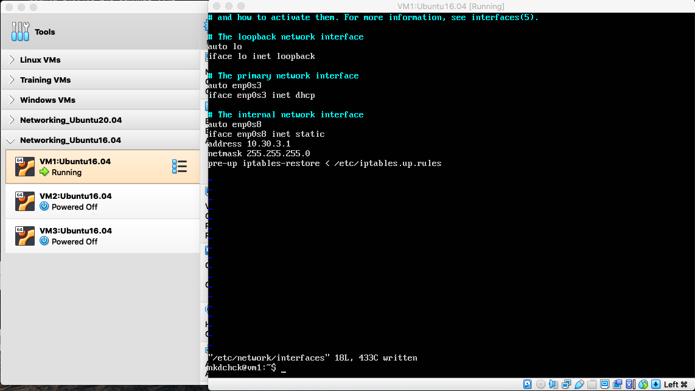
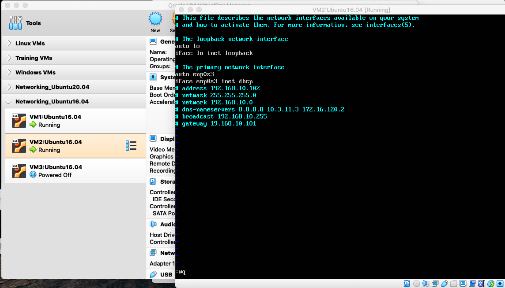
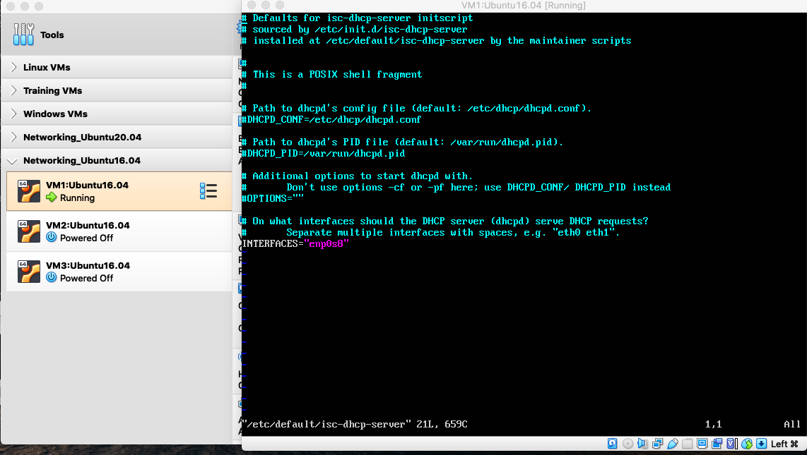
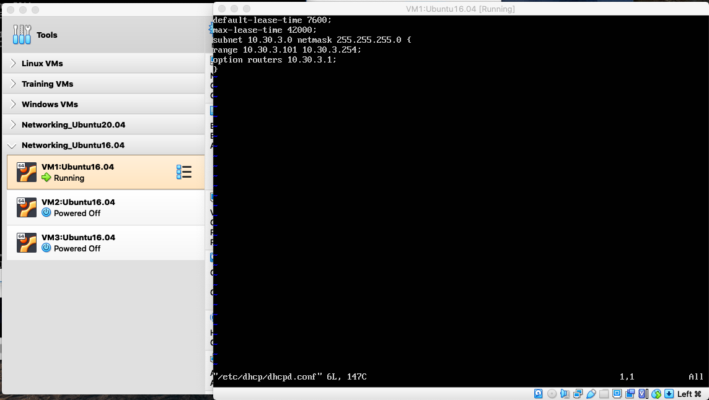

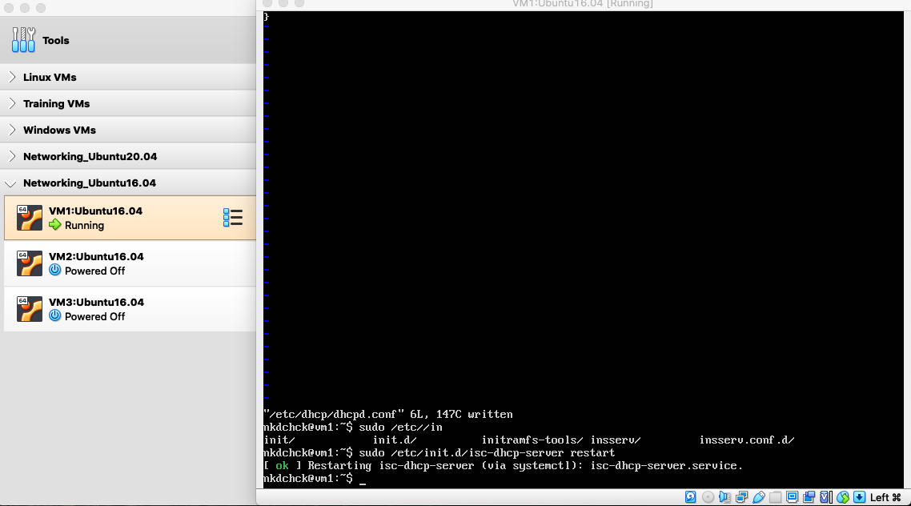

# Check `VM2` and `VM3`  for obtaining  network addresses from `DHCP server`
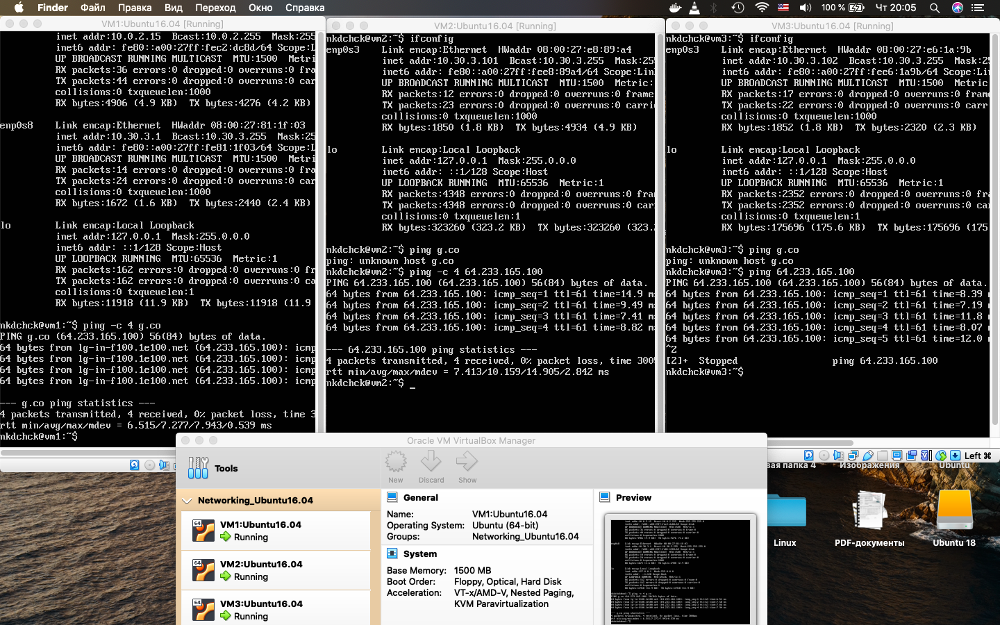

# Install and configure `DNS server` on `VM1`

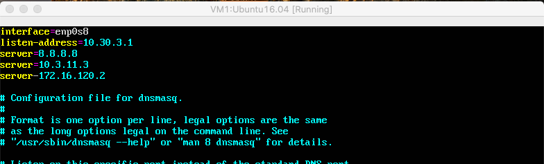
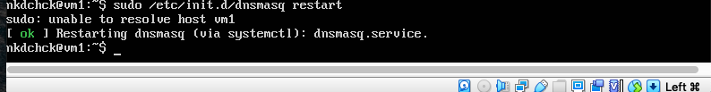
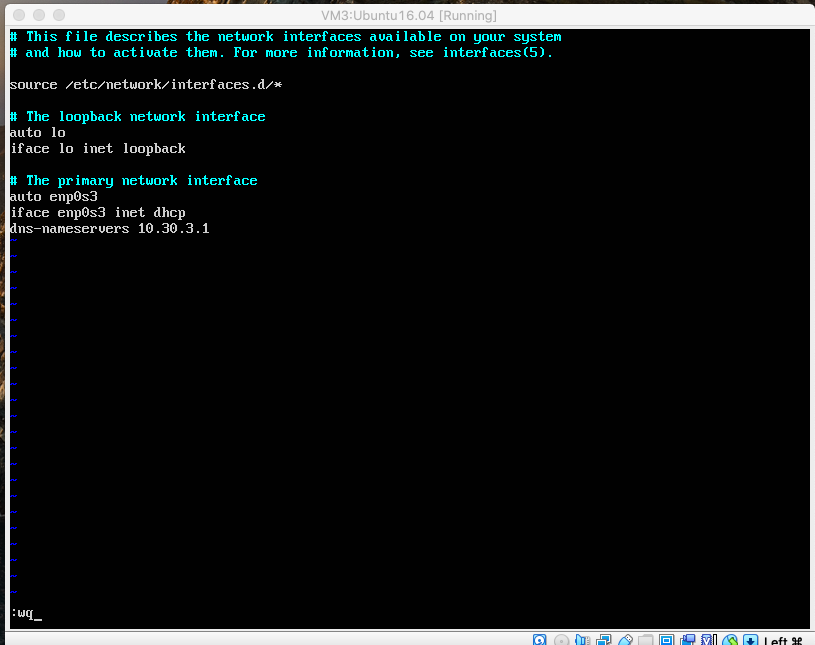
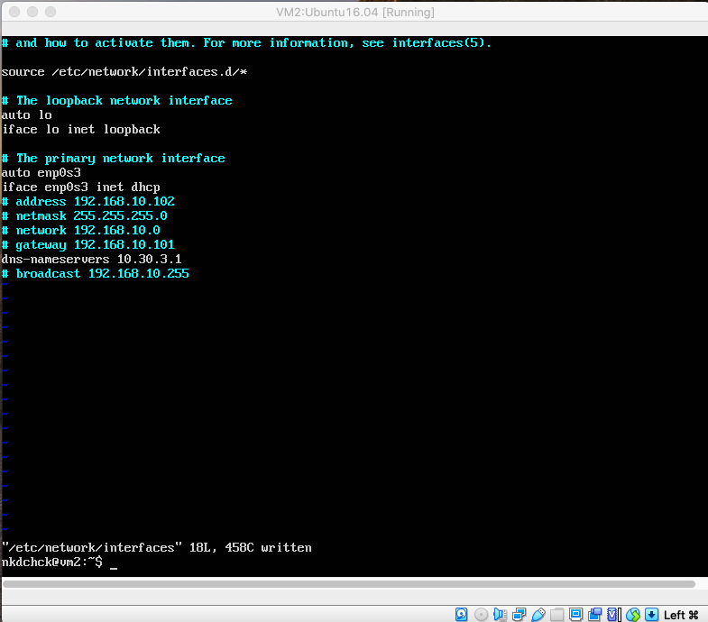

# Check `VM2` and `VM3`  for gaining access to `DNS server`

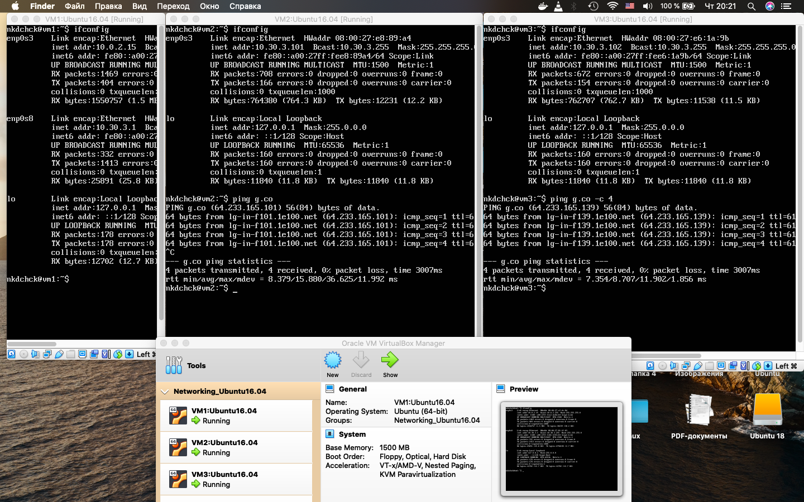
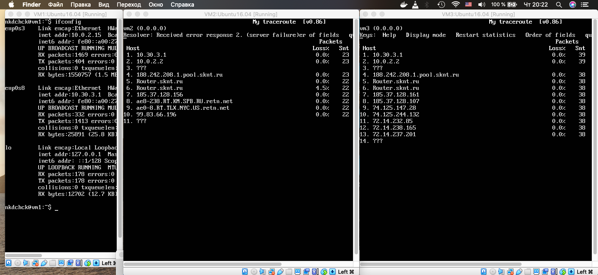

# Configure `dynamic routing` using `OSPF protocol`

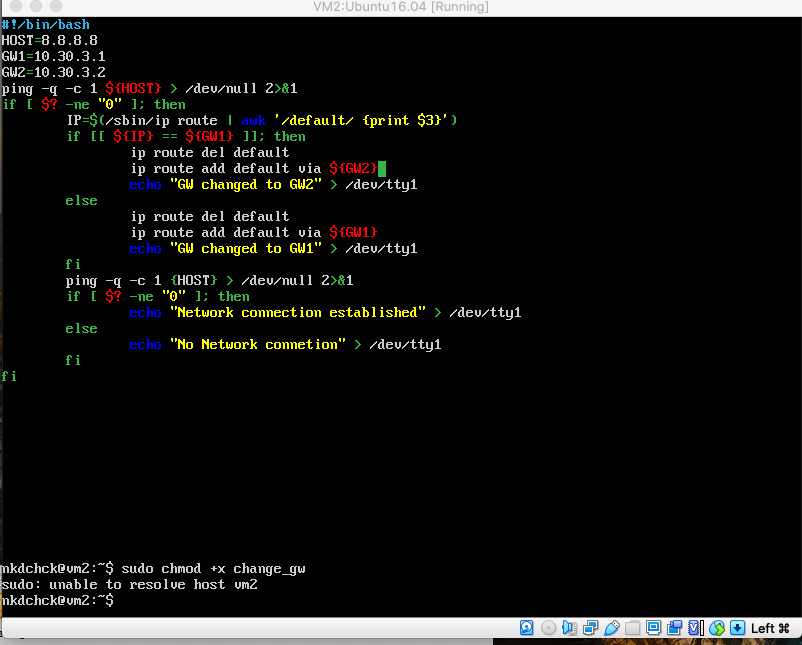
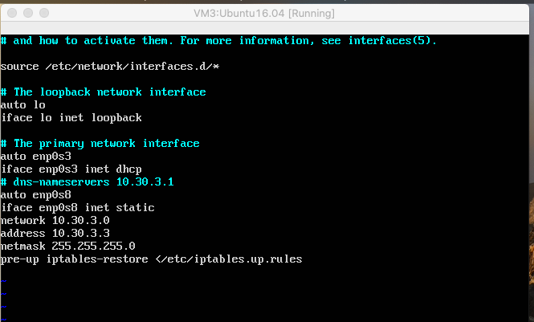
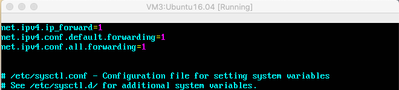
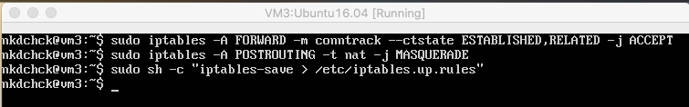
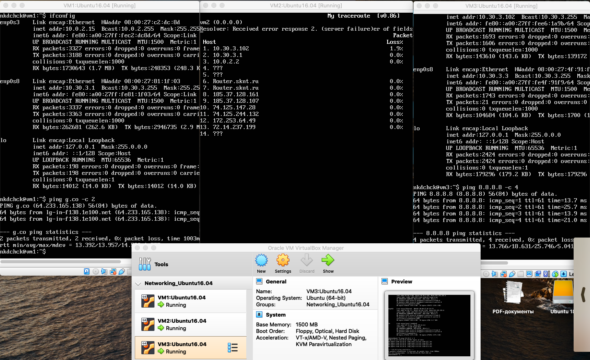
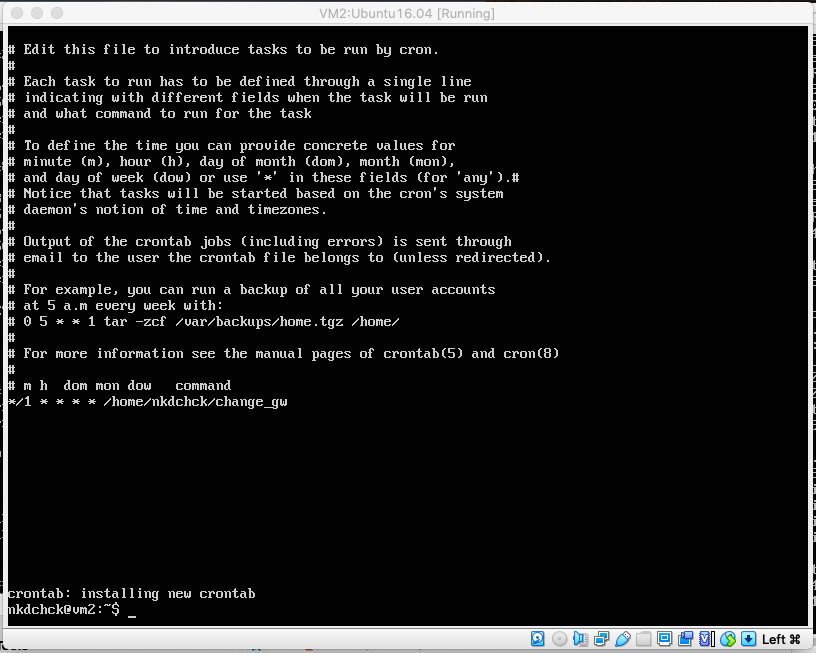
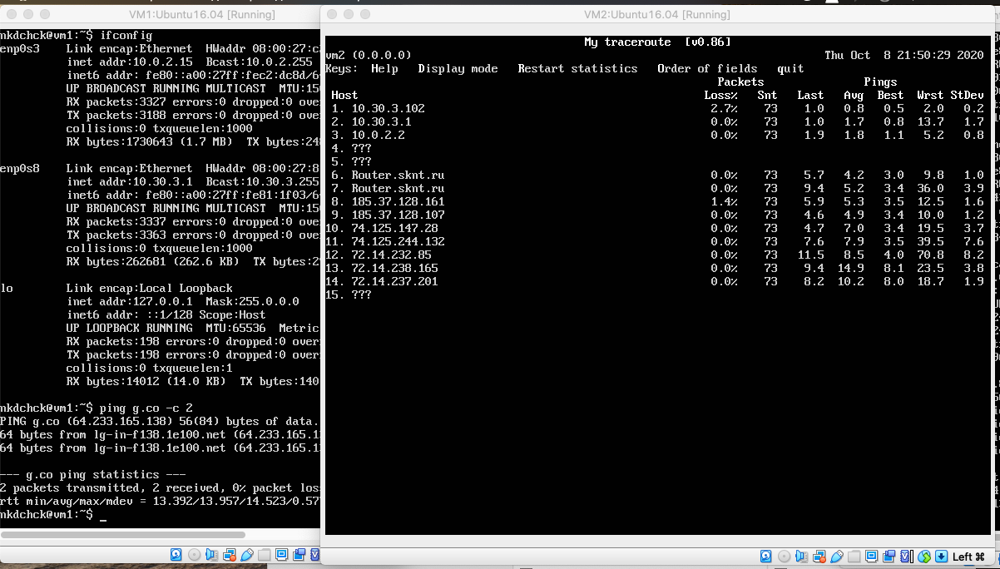