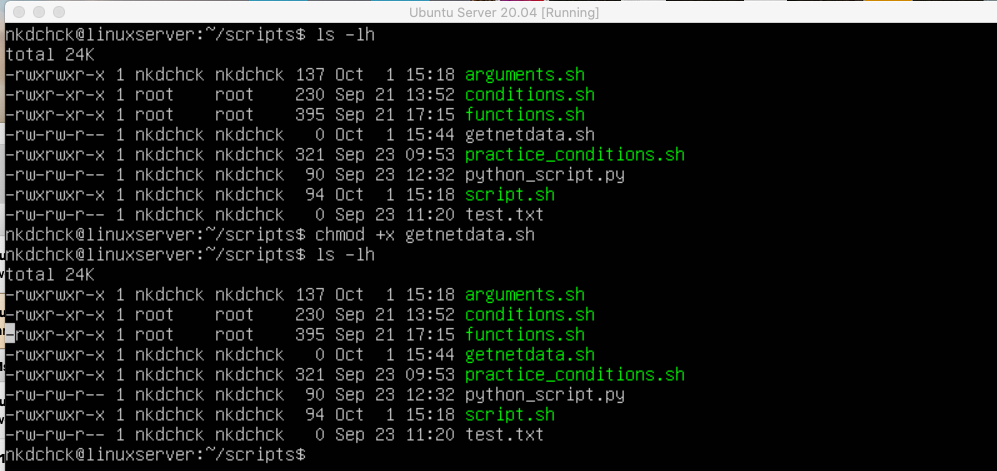

# Linux Administration with Bash: **task 6.3** (Dubenchuk Nikita)

### [Download Bash script file](getnetdata.sh)

- ## Final `Bash` script

```Bash
#!/bin/bash
# Function for getting list of IP addresses and symbolic names of hosts in a current subnet.
function get_current_subnet_ip_addresses() {
        printf "List of IP addresses and symbolic names of hosts in a current subnet:\n"
        host_ip=$(hostname -I | cut -f1,2,3 -d.)
        printf "$(sudo nmap -sn ${host_ip}.0/24 | awk '/Nmap scan report for/{printf $5;}/MAC Address:/{print " => "substr($0, index($0,$3)) }' | sort)\n\n"
}

# Function that can print docs for this program. You can add more data here if more features will be added.
function read_netstat_docs() {
            echo "--all : Displays the IP addresses and symbolic names of all hosts in the current subnet"
            echo "--target : Displays a list of open system TCP ports"
}

# Function for getting list of all open system TCP ports.
function get_open_tcp_ports() {
        printf "List of all open system TCP ports:\n"
        printf "$(sudo netstat -tlpn | grep LISTEN)\n\n"
}


if [[ $# -eq 0 ]]; then
        # If no arguments were passed   
        echo "Not enough parameters... You should provide at least one key. Please, read docs below :)"
          read_netstat_docs
elif [[ $# -gt 2 ]]; then
        # If user passed more than two arguments
        echo "Too much parameters... There are only to keys: [ --all ] and [ --target  ]. Please, read docs below :)"
          read_netstat_docs
else
          for key in $@; do 
                  ## Checking key correctness and calling corresponding function
                  if [[ $key == "--all" ]]; then
                          get_current_subnet_ip_addresses
                  elif [[ $key == "--target" ]]; then
                          get_open_tcp_ports
                  else 
                          # If wrong argument was passed
                          echo "Sorry, but key ${key} does not exists... Please, read docs below :)"
                          read_netstat_docs
                  fi
          done
fi
```




