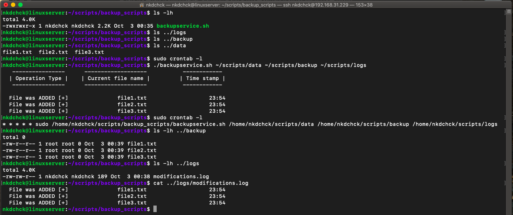
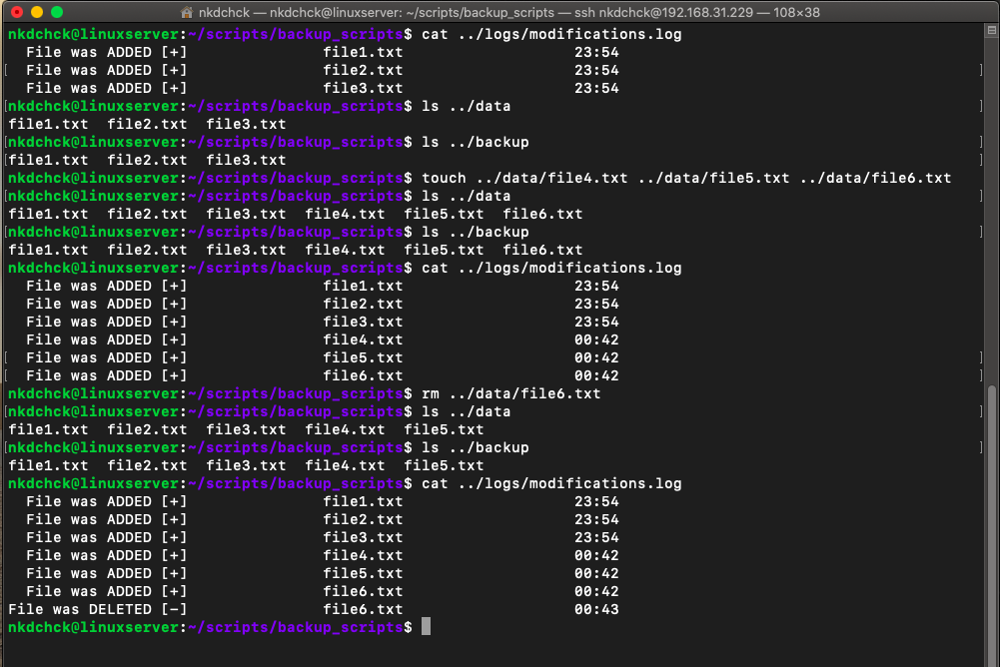

# Linux Administration with Bash: **task 6.4** (Dubenchuk Nikita)

### [Download Bash script file](backupservice.sh)

- ### Create folders for `backup` and `logs`
- ### Run `backupservice.sh` script with absolute paths as parameters: 
```Bash
$ ./backupservice.sh <path-to-data> <backup-folder-path> <logs-folder-path>
```
- ### You may be promted to enter `sudo` user password
- ### That's it! Script is added to `sudo crontab` file and will be executed `every minute`. You can check your backup drectory to see all data wich was copied or `<logs-folder-path>/modifications.log` file to see all the backup logs


- ## Final `Bash` script

```Bash

#!/bin/bash

# Absolute path to folder with data to backup
cync_dir=${1}

# Absolute path to folder where to copy data
backup_dir=${2}

# Absolute path where to put logs folder with all related files
logs_folder=${3}


diff -r $cync_dir $backup_dir | cut -f3,4 -d' ' > $logs_folder/tempfile

printf "%20s\t%20s\t%20s\n"   " ---------------- " " ------------------- " " ------------ "
printf "%20s\t%20s\t%20s\n"   "| Operation Type |" "| Current file name |" "| Time stamp |"
printf "%20s\t%20s\t%20s\n\n" " ---------------- " " ------------------- " " ------------ "


if [ ! -e ${logs_folder}/modifications.log ]; then
        #write out current crontab
        sudo crontab -l > $logs_folder/mycron
        #echo new cron into cron file
        sudo echo "* * * * * sudo /home/nkdchck/scripts/backup_scripts/backupservice.sh ${cync_dir} ${backup_dir} ${logs_folder}" >> $logs_folder/mycron
        #install new cron file
        sudo crontab $logs_folder/mycron
        sudo rm $logs_folder/mycron
fi


cat $logs_folder/tempfile | while read line
do
        file_name="$(echo $line | cut -d ' ' -f 2)"
        folder_name="$(echo $line | cut -d : -f 1)"
 
        if [[ "$folder_name" == "$cync_dir" ]]; then
            cp ${folder_name}/${file_name} $backup_dir
            name=$(stat --format=%n ${folder_name}/${file_name} | rev | cut -d/ -f1 | rev)
            last_mod_time=$(date -r ${folder_name}/${file_name} "+%H:%M")
            printf "%20s\t%20s\t%20s\n" "File was ADDED [+]" ${name} ${last_mod_time}
            printf "%20s\t%20s\t%20s\n" "File was ADDED [+]" ${name} ${last_mod_time} | tee --append ${logs_folder}/modifications.log >/dev/null
        
        elif [[ "$folder_name" == "$backup_dir" ]]; then
            name=$(stat --format=%n ${folder_name}/${file_name} | rev | cut -d/ -f1 | rev)
            last_mod_time=$(date -r ${folder_name}/${file_name} "+%H:%M")
            printf "%20s\t%20s\t%20s\n" "File was DELETED [-]" ${name} ${last_mod_time}
            printf "%20s\t%20s\t%20s\n" "File was DELETED [-]" ${name} ${last_mod_time} | tee --append ${logs_folder}/modifications.log >/dev/nul
        fi

done

if [ -e ${logs_folder}/modifications.log ]; then
        rm $backup_dir/* && cp $cync_dir/* $backup_dir
fi

rm $logs_folder/tempfile

```






