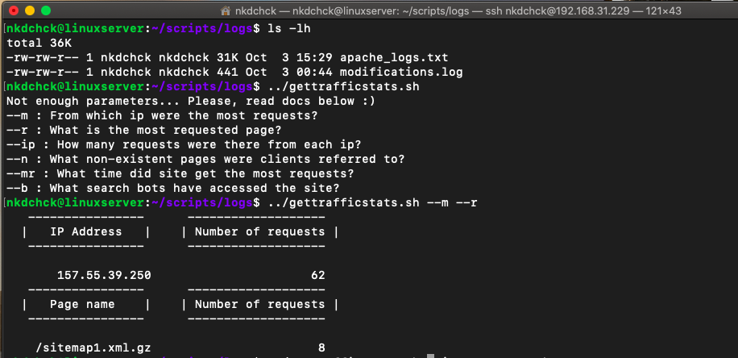
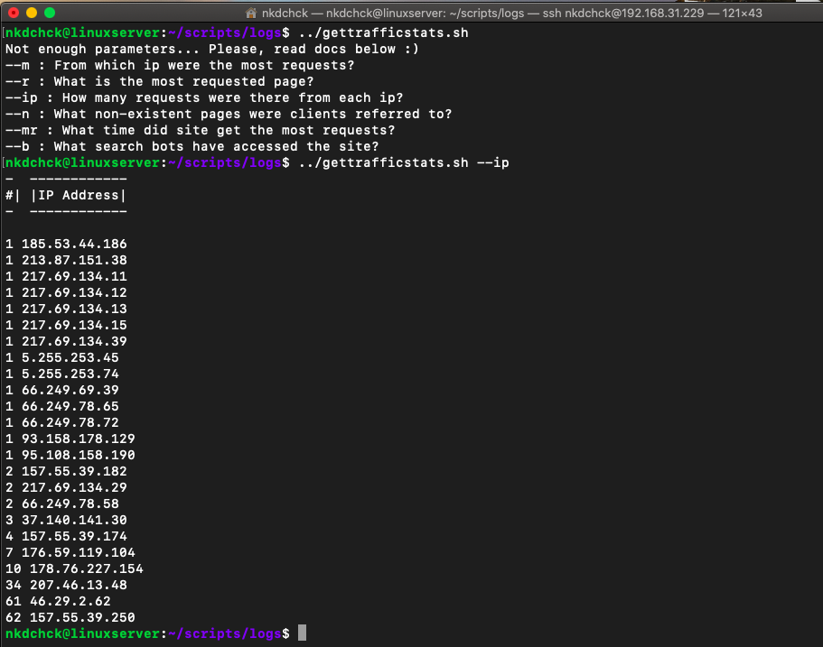
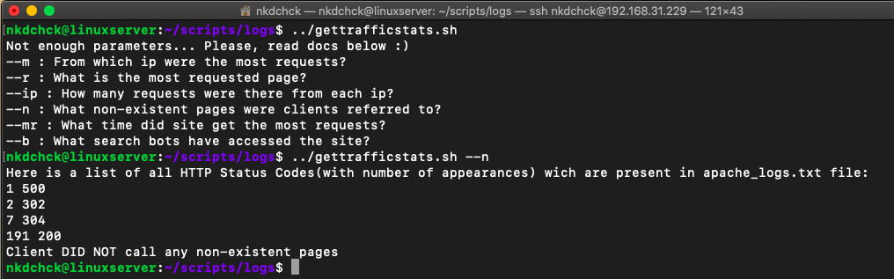
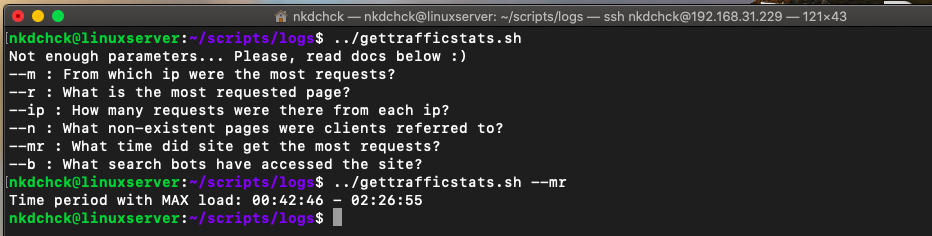
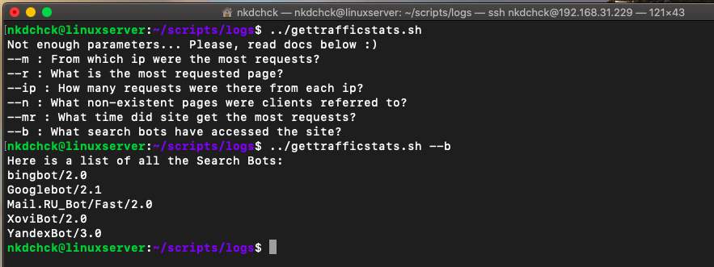
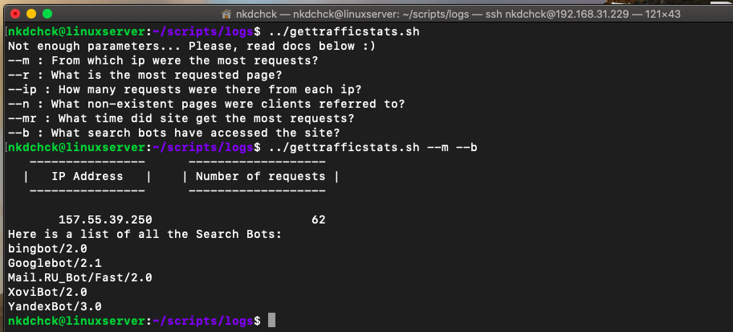

# Linux Administration with Bash: **task 6.5** (Dubenchuk Nikita)

### [Download Bash script file](gettrafficstats.sh)

- ## Place this script into the folder with `apache_logs.txt` file

## `--m` : From which ip were the most requests?
## `--r` : What is the most requested page?
## `--ip` : How many requests were there from each ip?
## `--n` : What non-existent pages were clients referred to?
## `--mr` : What time did site get the most requests?
## `--b` : What search bots have accessed the site?


```Bash
#!/bin/bash

# From which ip were the most requests? 
function get_ip_with_most_requests() {
        printf "%20s\t%20s\n"   " ---------------- " " -------------------  "
        printf "%20s\t%20s\n"   "|   IP Address   |" "| Number of requests |"
        printf "%20s\t%20s\n\n" " ---------------- " " -------------------  "
        printf "%20s\t%20s\n" "$(cat apache_logs.txt | cut -f1 -d' ' | sort  | uniq -c | sort -n | tail -1 | cut -f7 -d' ')" "$(cat apache_logs.txt | cut -f1 -d' ' | sort  | uniq -c | sort -n | tail -1 | cut -f6 -d' ')"
}

# What is the most requested page?
function get_page_with_most_requests() { 
        printf "%20s\t%20s\n"   " ---------------- " " -------------------  "
        printf "%20s\t%20s\n"   "|   Page name    |" "| Number of requests |"
        printf "%20s\t%20s\n\n" " ---------------- " " -------------------  "
        printf "%20s\t%20s\n" "$(cat apache_logs.txt | cut -f7 -d' ' | sort | uniq -c | sort -n | tail -1 | cut -f8 -d' ')" "$(cat apache_logs.txt | cut -f7 -d' ' | sort | uniq -c | sort -n | tail -1 | cut -f7 -d' ')"
}

# How many requests were there from each ip?
function number_of_requests_by_ip() { 
        printf "%1s %12s\n"   "-"  " ------------"
        printf "%1s %12s\n"   "#|" "|IP Address|"
        printf "%1s %12s\n\n" "-"  " ------------"
        printf "%20s\n" "$(cat apache_logs.txt | cut -f1 -d' ' | sort | uniq -c | sort -n | awk 'sub(/^ */, "")' | cut -f2,1 -d' ')"
}

# What non-existent pages were clients referred to?
function no_such_page() { 
        all_status_codes=$(cat apache_logs.txt | cut -f9 -d' ' | sort | uniq -c | sort -n  | awk 'sub(/^ */, "")' | cut -f2,1 -d' ')
        page_not_fount=$(cat apache_logs.txt | cut -f7,9 -d' ' | grep 400 | uniq -c | awk 'sub(/^ */, "")' | cut -f2,3 -d' ')
        echo "Here is a list of all HTTP Status Codes(with number of appearances) wich are present in apache_logs.txt file:"
        printf "%20s\n" "${all_status_codes}"
        if [ "$page_not_fount" == "" ]; then
                echo "Client DID NOT call any non-existent pages"
        else 
                echo "Here is file and corresponding return code:"
                echo $page_not_fount
        fi 
}

# What time did site get the most requests?
function peak_load_time() {
        number=$(cat apache_logs.txt | cut -f4 -d' ' | cut -d':' -f2,3,4 | uniq -c | sort -n | awk 'sub(/^ */, "")' | tail -1 | cut -f1 -d' ')
        max_peak_time=$(cat apache_logs.txt | cut -f4 -d' ' | cut -d':' -f2,3,4 | uniq -c | sort -n | awk 'sub(/^ */, "")' | grep "${number} " | tail -1 | cut -f2 -d' ')
        min_peak_time=$(cat apache_logs.txt | cut -f4 -d' ' | cut -d':' -f2,3,4 | uniq -c | sort -n | awk 'sub(/^ */, "")' | grep "${number} " | head -n 1 | cut -f2 -d' ')
        echo "Time period with MAX load: ${min_peak_time} - ${max_peak_time}"
}

# What search bots have accessed the site?
function list_all_search_bots() {
           short_bot_list=$(cat apache_logs.txt | grep -i 'bot/' | rev | cut -d' ' -f 2 | rev | cut -d';' -f1 | sort | uniq)
           echo "Here is a list of all the Search Bots:"
           printf "%s\n" $short_bot_list
}


# Function that can print docs for this program. You can add more data here if more features will be added.
function read_netstat_docs() {
            echo "--m : From which ip were the most requests?"
            echo "--r : What is the most requested page?"
            echo "--ip : How many requests were there from each ip?"
            echo "--n : What non-existent pages were clients referred to?"
            echo "--mr : What time did site get the most requests?"
            echo "--b : What search bots have accessed the site?"
}

if [[ $# -eq 0 ]]; then
        # If no arguments were passed   
        echo "Not enough parameters... Please, read docs below :)"
          read_netstat_docs
elif [[ $# -gt 6 ]]; then
        # If user passed more than two arguments
        echo "Too much parameters... There are only six keys. Please, read docs below :)"
          read_netstat_docs
else
          for key in $@; do 
                  ## Checking key correctness and calling corresponding function
                  if [[ $key == "--m" ]]; then
                          get_ip_with_most_requests
                  elif [[ $key == "--r" ]]; then
                          get_page_with_most_requests
                  elif [[ $key == "--ip" ]]; then
                          number_of_requests_by_ip
                  elif [[ $key == "--n" ]]; then
                          no_such_page
                  elif [[ $key == "--mr" ]]; then
                          peak_load_time
                  elif [[ $key == "--b" ]]; then                        
                          list_all_search_bots
                  else 
                          # If wrong argument was passed
                          echo "Sorry, but key ${key} does not exists... Please, read docs below :)"
                          read_netstat_docs
                  fi
          done
fi
```








