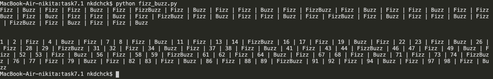
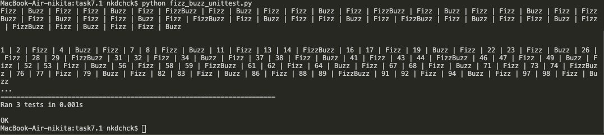
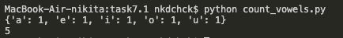
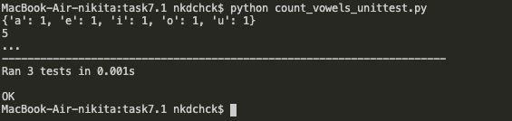

# Python Intro: **task 7.1** (Dubenchuk Nikita)

- ## FizzBuzz function for numbers from 1 to 100

```Python

def get_reply(number):
    if number%5==0 and number%3==0:
        return 'FizzBuzz'
    elif number%3==0:
        return 'Fizz'
    elif number%5==0:
        return 'Buzz'
    else:
        return ''

def fizzbuzz(n):
    result = []
    result_full = []
    for x in range(1, n+1):
        if get_reply(x) == 'FizzBuzz':
            result.append('FizzBuzz')
            result_full.append('FizzBuzz')
        elif get_reply(x) == 'Fizz':
            result.append('Fizz')
            result_full.append('Fizz')
        elif get_reply(x) == 'Buzz':
            result.append('Buzz')
            result_full.append('Buzz')
        else:
            result_full.append(str(x))
    return [result, result_full]

def main(n):
    print(' | '.join(fizzbuzz(n)[0]))
    print('\n')
    print(' | '.join(fizzbuzz(n)[1]))
    
main(100)
```




```Python

import fizz_buzz
import unittest

class FizzBuzzTest(unittest.TestCase):

    def test_fizz(self):
        number = 6
        result = fizz_buzz.get_reply(number)
        self.assertEqual(result, 'Fizz')
    
    def test_buzz(self):
        number = 50
        result = fizz_buzz.get_reply(number)
        self.assertEqual(result, 'Buzz')

    def test_fizzbuzz(self):
        number = 30
        result = fizz_buzz.get_reply(number)
        self.assertEqual(result, 'FizzBuzz')
    
if __name__ == '__main__':
    unittest.main()

```




- ## `count_vowels` function

```Python
def get_vowels(input_string):
    vowel_counts = {}
    lowercase = input_string.lower()
    for vowel in "aeiou":
        count = lowercase.count(vowel)
        vowel_counts[vowel] = count
    counts = vowel_counts.values()
    total_vowels = sum(counts)
    return [total_vowels, vowel_counts]

vowels = get_vowels('aeiou')
print(vowels[1])
print(vowels[0])
```



```Python

import count_vowels
import unittest

class FizzBuzzTest(unittest.TestCase):

    def test_fizz(self):
        string = "aeiou"
        only_unique_letters = set(string)
        result = count_vowels.get_vowels(string)
        self.assertEqual(result[0], 5)
        for vowel in only_unique_letters:
            self.assertEqual(result[1].get(vowel, None), 1)
    
    def test_buzz(self):
        string = "aaeeiioouu"
        only_unique_letters = set(string)
        result = count_vowels.get_vowels(string)
        self.assertEqual(result[0], 10)
        for vowel in only_unique_letters:
            self.assertEqual(result[1].get(vowel, None), 2)

    def test_fizzbuzz(self):
        string = "aaaeeeiiiooouuu"
        only_unique_letters = set(string)
        result = count_vowels.get_vowels(string)
        self.assertEqual(result[0], 15)
        for vowel in only_unique_letters:
            self.assertEqual(result[1].get(vowel, None), 3)
    
if __name__ == '__main__':
    unittest.main()

```




